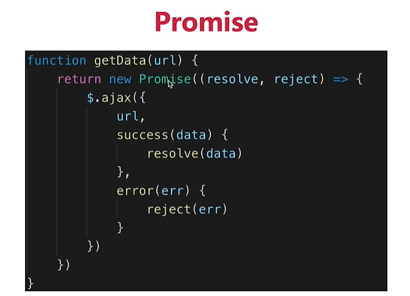

### 原型相关


#### 原型

- 每个函数都有一个显式原型属性: `prototype`

- 每个实例都有一个隐式原型属性: `__proto__`

- 实例的`__proto__`与对应函数的`prototype`都指向原型对象

- 原型对象上有一个`constructor`属性指向对应的构造函数

  function Fn () {}=>const Fn =new Function()=>var obj={} var obj=new Object({}) 

  const fn = new Fn()


- 问题1: 区别**执行函数定义**与**执行函数**

  - 执行函数定义: 也就是去创建函数对象, 只是有可能被JS引擎提升预处理执行
  - 执行函数: 执行函数体中所有语句

- 问题2: 说说函数对象上的**prototype属性**?

  - 执行函数定义定义(有可能被提升执行)创建函数对象

  - 给函数对象添加prototype属性, 属性值为空的Object实例对象, 也就是原型对象

  - 给原型对象添加constructor属性, 值为函数

  - 伪代码:

    ```js
    this.prototype = {}  // this就是函数对象
    this.prototype.constructor = Fn
    ```

- 问题3:  说说实例对象上的**`__proto__`属性**?

  - JS引擎在创建实例对象时内部自动执行时, 会自动给实例对象添加`__proto__`属性, 值为构造函数的 prototype属性的值

    ```js
    this.__proto__ = Fn.prototype  // this是实例对象
    ```

    

#### 原型链

- 从对象的`__proto__`开始, 连接的所有对象, 就是我们常说的原型链, 也可称为`隐式原型链`
- 查找对象属性简单说: 先在自身上查找, 找不到就沿着原型链查找,如果还找不到返回undefined


#### 查找对象上属性的基本流程

- 先在对象自身上查找, 如果有, 直接返回
- 如果没有, 根据`__proto__`在原型对象上查找, 如果有, 直接返回
- 如果没有根据原型对象的`__proto__`在原型对象的原型对象上查找, 一直查找到Object原型对象为止
- 如果找到了返回, 如果查找不到由于它的`__proto__`为null, 只能返回undefined


#### 表达式a.b的解析流程

- 查看a变量: 作用域链查看
  - 不存在 ==> 报错
  - 存在, 得到它的值
    - 基本类型
      - null/undefined  ===> 报错
      - number/string/boolean  ==> 创建一个包含此值的包装类型对象, 进入下面流程
    - 地址值   ===> 解析.b  ===> 查找b属性
      - 先在自身找, 找到了返回, 如果没有找到
      - 原型链查找
        - 找到了返回
        - 没找到, 返回undefined


#### instanceof

- 作用: 判断一个任意类型对象的具体类型

- 如何判断?
  - 对于 A instanceof B
  - A是实例对象, B是构造函数
  - 如果B的prototype属性所指向的原型对象是A实例对象的原型链接上的某个对象, 返回true, 否则返回false


#### 原型与原型链结构图

```js
function Foo () {}
const f1 = new Foo()
const f2 = new Foo()

const o1 = new Object()
const o2 = {}

Foo instanceof Object  true
Foo instanceof Function  true
Object instanceof Object  ?
Function instanceof Function  true
Function instanceof Object  ?

Object instanceof Foo
f1 instanceof Function
f1 instanceof Object
```


#### 继承

```js
/* 
使用构造函数和ES6的类设计并测试以下需要
  需求1: 
    现在2个人, 都有姓名与年龄(值自己指定), 都能自我介绍自己的姓名和年龄, 能得到当前的总人数
  需求2: 
    现在又有了一个学生, 它有身价的属性, 能介绍它的所有信息
    又有一个老师, 它有教授课程的属性, 能介绍它的所有信息
*/
```

- ***方式一: 基于构造函数的继承: 原型链 + 借用构造函数的组合式继承***
  - ***借用父类型构造函数: Person.call(this, name, age)***
  - ***让子类的原型为父类的实例: Student.prototype = new Person()***
  - ***让子类型原型的构造器为子类型: Student.prototype.constructor = Student***

```js
// 父类型
function Person(name, age) {
    this.name = name
    this.age = age
}

Person.prototype.fn = function () {}
Person.prototype.sayHello = function () {
	console.log(`我叫${this.name}, 年方${this.age}`)
}
// 子类型
function Student(name, age, price) {
    // this.name = name
    // this.age = age
    // 借用父类型的构造函数
    Person.call(this, name, age)  // 相当于执行this.Person(name, age)
    this.price = price
}
// 让子类的原型为父类的实例
Student.prototype = new Person()
// 让原型对象的构造器为子类型
Student.prototype.constructor = Student

Student.prototype.sayHello = function () {
	console.log(`我叫${this.name}, 年方${this.age}, 身价: ${this.price}`)
}

const s = new Student('tom', 23, 14000)
s.sayHello()
s.fn()
```


- ***方式二: 基于class/类的继承***
  - ***子类 extends 父类: class Teacher extends Person2***
  - ***子类构造器中调用父类的构造: super(name, age)***

```js
// 父类
class Person2 {
    constructor (name, age) {
        this.name = name
        this.age = age
    }

    fn () {}

    sayHello () {
    	console.log(`我叫${this.name}, 年方${this.age}`)
    }
}
// 子类
class Teacher extends Person2 {
    constructor (name, age, course) {
        super(name, age)
        this.course = course
    }

    // 重写父类的方法
    sayHello () {
    	console.log(`我叫${this.name}, 年方${this.age}, 课程:${this.course}`)
    }
}

const t = new Teacher('bb', 34, 'CC')
t.sayHello()
t.fn()
```


### 作用域相关


#### 作用域

变量可以合法使用的范围


#### 作用域分类

- 全局作用域
- 函数作用域
- 块级作用域(ES6新增): const / let


#### 作用域链

多个嵌套的作用域形成的由内向外的结构, 用于查找变量


#### 变量(声明)提升与函数声明提升

- 变量提升: 在变量定义语句之前, 就可以访问到这个变量(undefined)
- 函数提升: 在函数定义语句之前, 就执行该函数
- 原因: 简单来说就是在执行全局代码和函数前会进行预解析/处理
  - 将var变量声明放在最前面执行
  - 将function函数声明放在最前面执行
- 函数提升 ==> 变量提升, 同名的变量忽略


#### 闭包(以外存活的变量对象)

- 理解:

  - 当嵌套的内部函数引用了外部函数的变量时就产生了闭包
  - 什么时候产生的闭包?  执行内部函数定义(创建函数对象)后

- 通过chrome工具得知: 闭包本质是内部函数中的一个对象(非js的容器), 这个容器中包含引用的变量

- 作用

  - 延长局部变量的生命周期
  - 让函数外部能操作内部的局部变量

- 写一个闭包程序

  ```js
  function fn1() {
    var a = 2;
    function fn2() {
      a++;
      console.log(a);
    }
    return fn2;
  }
  var f = fn1();
  f();
  f();
  var f2 = f
  f = null
  
  
  function showDedelay (time, msg) {
      setTimeout(() => {
          alert(msg)
      }, time)
  }
  showDelay(1000)
  
  ```

  

- 区别闭包的三个操作
	- 产生闭包:  内部函数对象创建时产生, 包含那个被引用的变量的容器(不是js对象)
	- 使用闭包: 执行内部函数
	- 释放闭包: 让内部函数对象成为垃圾对象, 断开指向它的所有引用
	
- 闭包的应用: 

  - 举删除删除列表中的的某个商品的例子(带确定框)
  
- 


#### this在不同场景下的取值?

- this学习的2个目标:
  - **能判断出函数中的this是谁**
  - **能控制函数的this是需要的特定对象**

- 常规情况下, 函数中的this取决于执行函数的方式
  - fn(): 直接调用  ==> **this是?**  window
  - new fn(): new调用 ==> **this是?**  新建的对象
  - obj.fn(): 通过对象调用 ==> **this是?**  obj        obj.fn()()
  - fn.call/apply(obj): 通过函数对象的call/apply来调用 ==> **this是?**  obj

- 特殊情况:
  - bind(obj)返回的函数  ==> **this是?**  obj
  - 箭头函数 ==> **this是?**  外部作用域的this
  - 回调函数
    - 定时器/ajax/promise/数组遍历相关方法回调  ==> **this是?**  window
    - vue控制的回调函数  ==> **this是?**  组件的实例
    - React控制的生命周期回调, 事件监听回调  ==>  **this是?**  组件对象 / undefined

- 如何控制函数的this?  
  - 利用函数的bind()
  - 利用箭头函数
  - 也可以用外部保存了this的变量


### 异步相关

#### 单线程与异步

- JS是单线程编程语言, 只能同时做一件事

- js引擎是在一个线程(可以称为JS线程)上解析执行js代码的(web worker除外), 无论是同步代码还是异步代码

- 界面第一次渲染: 初始化同步代码 ==> 所有的微任务==> 渲染界面==> 执行第一个宏任务

  ​						==> 所有的微任务==> 渲染界面==> 执行第一个宏任务

  - 界面更新渲染: 所有的微任务==> 渲染界面==> 执行第一个宏任务
    总结: 清空微队列中所有微任务 ==> 渲染界(UI线程) ==> 执行宏队列中的第一个宏任务

- 浏览器在另一个线程(GUI渲染线程)进行页面渲染操作, 

- GUI渲染线程与js线程是互斥(不会同时执行), 因为 JS 可以修改 DOM 结构

- 遇到需要等待 (网络请求, 定时任务) 不能卡住

- 需要异步

- 回调callback函数


```js
<ul>
    <li>aaa</li>
    <li>bbb</li>
    <li>ccc</li>
</ul>
<button id="test">test</button>
<div id="content">
    aaaaaaa
</div>
<script>
    Promise.resolve().then(() => { // 微任务
        alert('promise1')
    }) 
    Promise.resolve().then(() => { // 微任务
        alert('promise2')
    }) 
    setTimeout(() => {// 宏任务
        alert(document.getElementById('content').innerHTML) 
    }, 0)
    document.getElementById('test').onclick = () => {// 宏任务
        document.getElementById('content').innerHTML = 'xxxx'  // dom渲染  
        Promise.resolve().then(() => { // 微任务
            alert('promise3')
        }) 
        setTimeout(() => {// 宏任务
            alert(document.getElementById('content').innerHTML) 
        }, 0);
    }
</script>
```


#### 同步与异步

- 基于 JS 是单线程编程语言
- 同步会阻塞代码执行
- 异步不会阻塞代码执行


#### 使用Promise解决回调地狱问题

Promise相对纯回调形式, 指定回调函数的时机更灵活(可以在发送请求后或请求结束后)





#### event loop1

- JS是通过事件循环机制来实现JS的单线程异步
- js是单线程运行的
- 异步要基于回调来实现
- event loop 就是异步回调的实现原理

.png)

事件循环机制的2个重要部分

​		在分线程执行的管理模块: 定时器/ajax/dom事件

​		保存待执行的回调函数的事件队列(Event queue)/任务队列(Task queue)


#### Node事件轮询机制

事件轮询机制主要分为**六个阶段**：

 1.timers 计时器阶段

　　计时和执行到点的定时器回调函数

 2.pending callbacks

　　某些系统操作（如tcp错误类型）的回调函数

 3.idle ，prepare

　　准备工作

 4.poll 轮询阶段（轮询队列）

　　如果轮询队列不为空，依次同步取出轮询队列中第一个回调执行，知道轮询队列为空或者达到系统最大的限制

　　如果轮询队列为空

　　　　如果之前设置过setImmediate函数

　　　　　　直接进入下一个check阶段

　　　　如果之前没有设置过setImmediate函数

　　　　　　在当前poll阶段等待

　　　　　　　　直到轮询队列添加回调函数，就去第一个情况执行

　　　　　　　　如果定时器到点了，也会去下一个阶段

 5.check 查阶段

　　执行setImmediate设置的回调函数

 6.close callbacks 关闭阶段

　　执行close时间回调函数


#### 宏任务与微任务

- 宏任务: setTimeout, setInterval, Ajax, DOM事件监听,setImmediate(Node)
- 微任务: Promise.then, async/await, mutationobserver(H5),process.nextTick(Node)


#### 宏队列与微队列

- 宏队列: 用来保存n个宏任务的队列容器
- 微队列: 用来保存n个微任务的队列容器


#### event loop2

- js-web中的dom事件回调, 定时器回调与ajax回调异步执行, 都是基于event loop   ===> 宏任务
- H5新的MutationObserver也基于event loop   ==> 微任务
- promise成功和失败的回调也是异步执行的, 也是基于event loop  ==> 微任务
- 执行顺序:
  - 第一步: 先执行script下的所有同步代码
  - 第二步: 再依次取出微列中的所有微任务执行
  - 第三步: 再取出宏队列中第一个宏任务执行
  - 再循环第二步与第三步


## Promise的理解

- ES6推出的新的更好的异步编程解决方案(相对于纯回调的方式)
  - 可以异步操作启动后或完成后, 再指定回调函数得到异步结果数据
  - 解决嵌套回调的回调地狱问题  ---promise链式调用
- promise对象有3种状态
  - pending 
  - resolved/fulfilled 
  - rejected
- promise状态的2种变化
  - pending --> resolved
  - pending --> rejected
  - 注意:  变化是不可逆


#### promise的then()的理解

- then()总是返回一个新的promise
- 新promise的结果状态由then指定的回调函数执行的结果决定
  - 抛出错误
  - 返回失败的promise
  - 返回成功的promise
  - 返回其它任何值


#### Promise.all([promise1, promise2, promise3])

- 批量/一次性发送多个异步请求
- 当都成功时, 返回的promise才成功
- 一旦有一个失败的, 返回的promise就失败了

问题: 发3请求成功后再4个请求


#### async/await与promise的关系

- async/await是消灭异步回调的终极武器
- 作用: 简化promise对象的使用, 不用再使用then/catch来指定回调函数
- 但和Promise并不互斥
- 反而, 两者相辅相成
- 执行async函数, 返回promise对象
- await相当于promise的then
- try...catch可捕获异常, 相当于promise的catch
