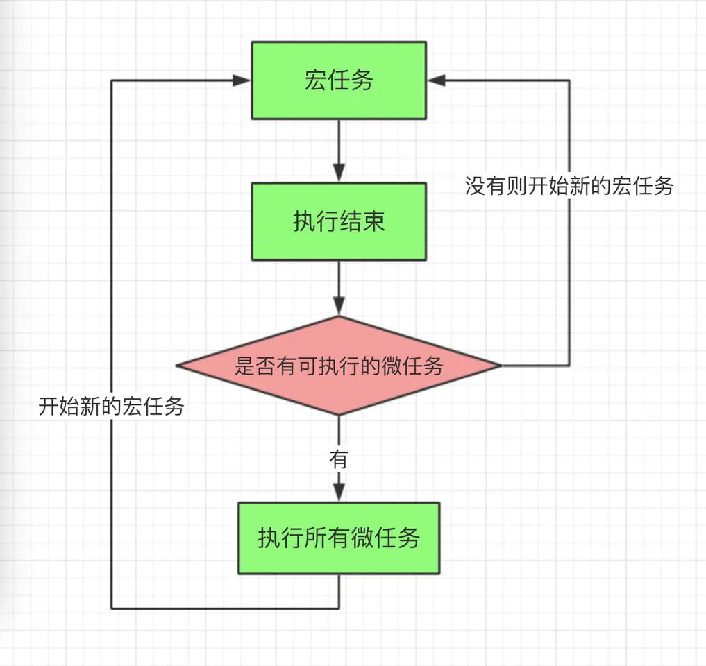

# 面试问题整理

## HTML + CSS

### 标签语义化的意义

1. 开发者更容易理解，减少差异化，方便团队开发和维护
2. 机器更容易理解结果（搜索爬虫、方便其他设备解析（读屏幕软件、盲人设备、移动设备）

### 写页面结构应该注意的

1. 尽可能少的使用没有语义的 div 和 span 元素
2. 块级元素和内联元素的嵌套一定要符合 web 标准，比如内联元素就是不能嵌套块级元素

### HTML5 新特性

1. 新的语义化元素：article 、footer 、header 、nav 、section
2. 表单增强，新的表单控件：calendar 、date 、time 、email 、url 、search
3. 新的 API：音频(用于媒介回放的 video 和 audio 元素)、图形（绘图 canvas 元素）
4. 新的 API：离线，通过创建 cache manifest 文件，创建应用程序缓存
5. 新的 API：本地存储，localStorage-没有时间限制的数据存储，sessionStorage-session 数据存储（关闭浏览器窗口数据删除）
6. 新的 API：实时通讯，设备能力

### 盒模型

页面渲染时，dom 元素所采用的 **布局模型**。可通过`box-sizing`进行设置。根据计算宽高的区域可分为：

- `content-box` (W3C 标准盒模型)
- `border-box` (IE 盒模型)
- `padding-box`
- `margin-box` (浏览器未实现)

### BFC

**块级格式化上下文**，是一个独立的渲染区域，让处于 BFC 内部的元素与外部的元素相互隔离，使内外元素的定位不会相互影响。

> IE 下为 Layout，可通过 zoom:1 触发

- 触发条件:
  - 根元素
  - `position: absolute/fixed`
  - `display: inline-block / table`
  - `float` 元素
  - `ovevflow` !== `visible`
- 规则:

  - 属于同一个 BFC 的两个相邻 Box 垂直排列
  - 属于同一个 BFC 的两个相邻 Box 的 margin 会发生重叠
  - BFC 中子元素的 margin box 的左边， 与包含块 (BFC) border box 的左边相接触 (子元素 absolute 除外)
  - BFC 的区域不会与 float 的元素区域重叠
  - 计算 BFC 的高度时，浮动子元素也参与计算 - 文字层不会被浮动层覆盖，环绕于周围

- 应用:
  - 阻止`margin`重叠
  - 可以包含浮动元素 —— 清除内部浮动(清除浮动的原理是两个`div`都位于同一个 BFC 区域之中)
  - 自适应两栏布局
  - 可以阻止元素被浮动元素覆盖

### 选择器优先级

- `!important` > 行内样式 > `#id` > `.class` > `tag` > \* > 继承 > 默认
- 选择器 **从右往左** 解析

### 去除浮动影响，防止父级高度塌陷

- 通过增加尾元素清除浮动
- `:after / <br> : clear: both`
- 创建父级 BFC
- 父级设置高度

### link 与 @import 的区别

- `link`功能较多，可以定义 RSS，定义 Rel 等作用，而`@import`只能用于加载 css
- 当解析到`link`时，页面会同步加载所引的 css，而`@import`所引用的 css 会等到页面加载完才被加载
- `@import`需要 IE5 以上才能使用
- `link`可以使用 js 动态引入，`@import`不行

### CSS 预处理器(Sass/Less/Postcss)

CSS 预处理器的原理: 是将类 CSS 语言通过 **Webpack 编译** 转成浏览器可读的真正 CSS。在这层编译之上，便可以赋予 CSS 更多更强大的功能，常用功能:

- 嵌套
- 变量
- 循环语句
- 条件语句
- 自动前缀
- 单位转换
- mixin 复用

### **单行文本溢出**

```css
white-space: nowrap;
overflow: hidden;
text-overflow: ellipsis;
```

### **多行文本溢出**

```css
overflow: hidden;
text-overflow: ellipsis;
display: -webkit-box;
-webkit-line-clamp: 2; /*2*/
-webkit-box-orient: vertical;
```


### flex布局

- flex:1，单独给某一个子元素设置flex属性的时候可以提高当前flex的权重

### 圣杯布局

- 圣杯特点简单记为：有头、有尾、包三列，圣杯布局中间有container大容器包裹着左、中、右三列区域
- 左、中、右是独立的三个区域，都处于一个层级

### 双飞翼布局

- 左、中、右是独立的三个区域，中间区域属于最上面的层级


## JS基础和高级

### typeof 能判断什么?

- 识别所有基本类型(null除外)
- 识别函数
- 识别是不是引用类型(不可再细分对象还是数组)

### 字符串强转数字

- +号
- *1

### **面向对象**

#### **作用域**

1. 什么是作用域

   用来规定代码作用的范围及变量查询的范围

2. 作用域的作用

   隔离变量, 防止命名冲突

3. 作用域什么时候产生及销毁

   - 代码定义的时候产生

   - 函数执行完销毁的是变量对象而不是作用域
   - 作用域从代码定义的时候就一直在，除非没有当前代码

4. **作用域链**

   - 查找变量的时候现在当前作用域的变量对象中查找，如果有就使用，如果没有会继续去上级作用域查找，直到找到全局作用域，如果还没有就报错，报错内容： xxx is not defined, 查找的过程就是沿着作用域链查找
   - 本质: 是一个数组，数组包含上级所有的变量对象

#### **执行上下文环境**

js代码在正式执行之前js引擎会先做一些准备工作

1. 创建执行上下文环境
2. 创建一个空的对象(执行上下文对象)，该对象用于收集当前作用域的：变量，函数，函数的参数
3. 确认this的指向
4. 创建当前环境的作用域链

#### 闭包

- **闭包的形成条件**

  1. 函数嵌套

  2. 内部函数引用外部函数的局部变量

  3. 调用外部函数, 执行内部函数定义

     注意: 如果外部函数执行完后, 内部函数对象如果没有被外部变量引用, 内部函数对象与闭包就会立即被回收释放

- **什么是闭包**

  1. 闭包是抽象的概念
  2. 闭包其实指的就是满足一定的条件下(闭包的形成条件)，会形成一个闭包的容器(非js对象)
  3. 该对象用于收集内部函数使用的外部函数的变量
  4. 该对象在内部函数调用的时候供内部函数使用
  5. 因为闭包形成的闭合对象保存在内部函数的[[scopes]]中

#### this在不同场景下的取值?

- this学习的2个目标:
  - **能判断出函数中的this是谁**
  - **能控制函数的this是需要的特定对象**

- 常规情况下, 函数中的this取决于执行函数的方式
  - fn(): 直接调用  ==> **this是?**  window
  - new fn(): new调用 ==> **this是?**  新建的对象
  - obj.fn(): 通过对象调用 ==> **this是?**  obj
  - fn.call/apply(obj): 通过函数对象的call/apply来调用 ==> **this是?**  obj

- 特殊情况:
  - bind(obj)返回的函数  ==> **this是?**  obj
  - 箭头函数 ==> **this是?**  外部作用域的this
  - 回调函数
    - 定时器/ajax/promise/数组遍历相关方法回调  ==> **this是?**  window
    - vue控制的回调函数  ==> **this是?**  组件的实例
    - React控制的生命周期回调, 事件监听回调  ==>  **this是?**  组件对象 / undefined

- 如何控制函数的this?  
  - 利用函数的bind()
  - 利用箭头函数
  - 也可以用外部保存了this的变量

#### 原型

- **什么是原型对象**

  1. 每个函数的prototype指向的是其显示原型对象

  2. 每个实例的`__proto__`指向的是其隐式原型对象

  3. 实例的隐式原型对象 === 其构造函数的显示原型对象

- **原型链**

  1. 对象查找属性的时候现在自身查找，如果自身没有沿着`__proto__`这条链查找
  2. 如果有就使用，如果没有就继续向上查找直到找到Object.prototype，如果还没有就返回undefined

- **原型继承**

  1. 子类的原型成为父类的实例
  2. 需要执行子类的构造属性constructor

- **借用构造函数继承**

  不是真正意义上的继承，只是简化子类构造函数的代码

- 组合继承

  原型继承 + 借用构造函数继承


## 异步相关

### 单线程与异步

- JS是单线程编程语言, 只能同时做一件事
- 浏览器和 nodejs 已支持 JS 启动分线程, 如: Web Worker
- JS 和 DOM 渲染共用主线程, 因为 JS 可以修改 DOM 结构
- 遇到需要等待 (网络请求, 定时任务) 不能卡住
- 需要异步
- 回调callback函数

### 同步与异步

- 基于 JS 是单线程编程语言
- 同步会阻塞代码执行
- 异步不会阻塞代码执行

### 使用Promise解决回调地狱问题

Promise相对纯回调形式, 指定回调函数的时机更灵活(可以在发送请求后或请求结束后)


### event loop1(全宏任务)

- js是单线程运行的
- 异步要基于回调来实现
- event loop 就是异步回调的实现原理

.png)

事件循环机制的2个重要部分

​		在分线程执行的管理模块: 定时器/ajax/dom事件

​		保存待执行的回调函数的事件队列


### 宏任务与微任务

- 宏任务: setTimeout, setInterval, Ajax, DOM事件监听
- 微任务: Promise, async/await, mutationobserver(H5)

### 宏队列与微队列

- 宏队列: 用来保存n个宏任务的队列容器
- 微队列: 用来保存n个微任务的队列容器

### event loop2(宏任务 & 微任务)

- js-web中的dom事件回调, 定时器回调与ajax回调异步执行, 都是基于event loop   ===> 宏任务
- H5新的MutationObserver也基于event loop   ==> 微任务
- promise成功和失败的回调也是异步执行的, 也是基于event loop  ==> 微任务
- 执行顺序:
  - 第一步: 先执行script下的所有同步代码
  - 第二步: 再依次取出微列中的所有微任务执行
  - 第三步: 再取出宏队列中第一个宏任务执行
  - 再循环第二步与第三步




### Promise的理解

- ES6推出的新的更好的异步编程解决方案(相对于纯回调的方式)
  - 可以异步操作启动后或完成后, 再指定回调函数得到异步结果数据
  - 解决嵌套回调的回调地狱问题  ---promise链式调用
- promise对象有3种状态
  - pending 
  - resolved/fulfilled 
  - rejected
- promise状态的2种变化
  - pending --> resolved
  - pending --> rejected
  - 注意:  变化是不可逆

### promise的then()的理解

- then()总是返回一个新的promise
- 新promise的结果状态由then指定的回调函数执行的结果决定
  - 抛出错误
  - 返回失败的promise
  - 返回成功的promise
  - 返回其它任何值

### Promise.all()

- 语法: Promise.all([promise1, promise2, promise3])
- 批量/一次性发送多个异步请求
- 当都成功时, 返回的promise才成功
- 一旦有一个失败的, 返回的promise就失败了

### async/await与promise的关系

- async/await是消灭异步回调的终极武器
- 作用: 简化promise对象的使用, 不用再使用then/catch来指定回调函数
- 但和Promise并不互斥
- 反而, 两者相辅相成
- 执行async函数, 返回promise对象
- await相当于promise的then
- try...catch可捕获异常, 相当于promise的catch


### 综合性执行流程题

```js
setTimeout(() => {
    console.log("0")
  }, 0)
  new Promise((resolve,reject)=>{
    console.log("1")
    resolve()
  }).then(()=>{        
    console.log("2")
    new Promise((resolve,reject)=>{
      console.log("3")
      resolve()
    }).then(()=>{      
      console.log("4")
    }).then(()=>{       
      console.log("5")
    })
  }).then(()=>{  
    console.log("6")
  })

  new Promise((resolve,reject)=>{
    console.log("7")
    resolve()
  }).then(()=>{         
    console.log("8")
  })
T	1	7
W	2 3	 8  4  6  5	
H	0
```


## ES6+

### var, const, let的区别

- const定义常量, let/var定义变量
- const和let相对于var
  - 有块作用域
  - 没有变量提升
  - 不会添加到window上
  - 不能重复声明

### 箭头函数的特点

- 没有自己的this, 使用外部作用域中的this, 不能通过bind来绑定this
- 不能通过new来创建实例对象
- 内部没有arguments, 可以通过rest参数来代替

### 说说在项目中使用的ES6语法?

- 新的语法:
  - const / let
  - 解构赋值
  - 模板字符串
  - 箭头函数 / 形参默认值 / rest参数
  - 扩展运算符(...)拆解数组或对象
  - 模板化相关语法
- 新的API
  - Array.from() / Array.of()
  - arr.find() / arr.flat()
  - string.includes()
  - promise ==> async & await  ==> 异步封装 / ajax请求
  - Map, Set    ===> 解决深拷贝循环引用的问题, 数组去重
  - Proxy与Reflect   ===> Vue3内部用来实现数据响应式


## Web API

### 事件冒泡与事件委托

#### 1) 事件冒泡的流程

- 基于DOM树形结构
- 事件在目标元素上处理后, 会由内向外(上)逐层传递
- 应用场景: 事件代理/委托/委派

#### 2) 事件委托

- 减少内存占用(事件监听回调从n变为1)
- 动态添加的内部元素也能响应
- 代码简洁
- 不要滥用

### window.onload和$(document).ready()区别

- window.onload是在待网页中所有内容加载完毕之后（包括图片）回调
- 而$(documetn).ready()内部使用的是DOMContentLoaded监听, 在文档内容加载完成, 但图片还未加载加完前回调

### 前台数据存储

#### 存储方式

- cookie

- sessionStorage

- localStorage

  注意: session后台数据存储

#### 区别 localStoarge与sessionStorage

- 相同点:
  - 纯浏览器端存储, 大小不受限制, 请求时不会自动携带
  - 只能保存文本, 如果是对象或数组, 需要转换为JSON
  - API相同:
    - setItem(key, value)
    - getItem(key, value)
    - removeitem(key, value)
  - 浏览器不能禁用
- 不同点:
  - localStorage保存在本地文件中, 除非编码或手动删除, 否则一直存在
  - sessonStorage数据保存在当前会话内存中, 关闭浏览器则清除


#### 区别cookie 与 localStorage和sessionStorage

- 容量:  cookie小
- 请求时是否自动携带:  cookie自动携带
- API易用性:  cookie的操作语法不方便
- 浏览器是否可禁用: cookie可禁用

#### 区别cookie与session

- cookie保存在浏览器端(前台可以操作)
- session保存在服务器端(前台不能操作)
- session依赖于cookie(session的id以cookie的形式保存在浏览器端)

### ajax

#### xhr.status: 响应状态码

- 2XX: 表示成功处理请求, 
  - 200: 成功
  - 201: 添加数据成功
- 3XX: 需要生定向, 浏览器直接跳转, 
  - 302: 自动重定向到指定url
- 4XX: 客户端请求错误, 如:  
  - 401: 没有访问的权限
  - 404 : 访问的资源不存在
- 5XX: 服务器端错误
  - 500: 服务器端程序运行出错了

#### 区别ajax请求与一般HTTP请求

- ajax请求是一种特别的http请求
- 对服务器端来说, 没有任何区别, 区别在浏览器端
- 浏览器端发请求: 只有XHR或fetch发出的才是ajax请求, 其它所有的都是非ajax请求
- 浏览器端接收到响应
  - 一般请求: 浏览器一般会直接显示响应体数据, 也就是我们常说的刷新/跳转页面
  - ajax请求: 浏览器不会对界面进行任何更新操作, 只是调用监视的回调函数并传入响应相关数据

#### 封装一个简易的ajax异步请求函数

##### 简洁版(必须)

```js
/* 
xhr + promise 封装一个异步ajax请求的通用函数  简洁版
*/
function ajax(url) {
  return new Promise((resolve, reject) => {
    // 创建一个XHR对象
    const xhr = new XMLHttpRequest()
    // 初始化一个异步请求(还没发请求)
    xhr.open('GET', url, true)
    xhr.onreadystatechange = function () {
      // 如果状态值不为4, 直接结束(请求还没有结束)
      if (xhr.readyState !== 4) {
        return
      }
      // 如果响应码在200~~299之间, 说明请求都是成功的
      if (xhr.status>=200 && xhr.status<300) {
        // 指定promise成功及结果值
        resolve(JSON.parse(xhr.responseText))
      } else { // 请求失败了
        // 指定promise失败及结果值
        reject(new Error('request error staus '+ request.status))
      }
    }
    xhr.send(null)
  })
}
```

##### 加强版(可选)

```js
/* 
xhr + promise 封装一个异步ajax请求的通用函数  加强版
  返回值: promise
  参数为配置对象
    url: 请求地址
    params: 包含所有query请求参数的对象
    data: 包含所有请求体参数数据的对象
    method: 为请求方式
*/
function axios({url, params={}, data={}, method='GET'}) {
  // 返回一个promise对象
  return new Promise((resolve, reject) => {
    // 创建一个XHR对象
    const request = new XMLHttpRequest()
    
    // 根据params拼接query参数
    let queryStr = Object.keys(params).reduce((pre, key) => {
      pre += `&${key}=${params[key]}`
      return pre
    }, '')
    if (queryStr.length>0) {
      queryStr = queryStr.substring(1)
      url += '?' + queryStr
    }
    // 请求方式转换为大写
    method = method.toUpperCase()
    
    // 初始化一个异步请求(还没发请求)
    request.open(method, url, true)
    // 绑定请求状态改变的监听
    request.onreadystatechange = function () {
      // 如果状态值不为4, 直接结束(请求还没有结束)
      if (request.readyState !== 4) {
        return
      }
      // 如果响应码在200~~299之间, 说明请求都是成功的
      if (request.status>=200 && request.status<300) {
        // 准备响应数据对象
        const responseData = {
          data: JSON.parse(request.response),
          status: request.status,
          statusText: request.statusText
        }
        // 指定promise成功及结果值
        resolve(responseData)
      } else { // 请求失败了
        // 指定promise失败及结果值
        const error = new Error('request error staus '+ request.status)
        reject(error)
      }
    }

    // 如果是post/put请求
    if (method==='POST' || method==='PUT' || method==='DELETE') {
      // 设置请求头: 使请求体参数以json形式传递
      request.setRequestHeader('Content-Type', 'application/json;charset=utf-8')
      // 包含所有请求参数的对象转换为json格式
      const dataJson = JSON.stringify(data)
      // 发送请求, 指定请求体数据
      request.send(dataJson)
    } else {// GET请求
      // 发送请求
      request.send(null)
    }
  })
}
```


#### 跨域

- 什么是跨域(同源策略)
- JSONP
- CORS
- 代理服务器


#### 同源策略

- 同源: 协议, 域名, 端口, 三者都相同
- ajax请求时, 浏览器要求当前网页和Server必须同源(安全), 否则会抛出跨域的错误
- 加载image/link/script不受同源策略限制

#### JSONP原理

- 前台:

  - `<script src="目标url?callback=fn" />`

  - 接收响应数据的函数: function fn (data) {}

- 后台

  - 处理请求, 产生需要返回的数据data
  - 读取callback请求参数得到前台处理响应数据的函数名fn
  - 返回执行函数fn的js代码: 'fn && fn(data)'

- 不足

  - 只能处理GET请求
  - 每个请求在后台都要做处理, 麻烦

  ```js
  // 发送jsonp请求的函数
  function jsonp() {
      var script = document.createElement('script')
      script.type = 'text/javascript'
      // 传参并指定回调执行函数为backFn
      script.src = 'http://localhost:4000/getUserInfo?id=100&callback=cbFn'
      document.body.appendChild(script)
  }
  
  // 回调函数, 接收响应数据
  function cbFn(data) {
  	console.log(data)
  }
  ```

  

#### CORS原理

- 后台: 返回允许浏览器在某个域上发送跨域请求的相关响应头

```js
// 使用cors, 允许跨域, 且允许携带跨域cookie
app.use(function (req, res, next) {
  // console.log('----')
  // 允许跨域的地址
  res.header('Access-Control-Allow-Origin', 'http://localhost:5500')  // 不要是*
  // 允许携带凭证(也就是cookie)
  res.header('Access-Control-Allow-Credentials', 'true')
  // 允许跨域的请求头
  res.set("Access-Control-Allow-Headers", "Content-Type")
  // 放行
  next()
})
```

- 前台: 不需要做特别任何处理

```js
axios.defaults.withCredentials = true // 允许携带cookie
xhr.withCredentials = true
```

#### 代理服务器

- 开发环境: 利用webpack-dev-server中的http-proxy-middle  进行正向代理
  - vue脚手架项目: vue.config.js
  - react脚手架项目: package.json
- 生产环境: 利用nigix  进行反向代理


#### 使用axios发送ajax请求

```js
// 发请求的基本语法
axios(url)
axios({
    method: '',
    url: '',
    params: {},
    data: {}
})
axios.get(url, {配置})
axios.post(url, data, {配置})
axios.put(url, data, {配置})
axios.delete(url, {配置})

// 创建新的axios
const instance = axios.create({
    baseURL: '',
    timeout: 20000,
})

// 添加请求拦截器
instance.interceptors.request.use((config) => {
   	// 添加请求头
    config.headers['token'] = token值
    return config // 必须返回config
})

// 添加响应拦截器
instance.interceptors.response.use(
    response => {
        // return response
        return response.data
    },
    error => {
        
    }
)

// 请求某个具体的接口
instance({
  url: '/xxx'
}).then(data => {
    
})

```


### Restless API 与 Restful API

- Restless API  

  - 传统的API, 把每个url当作一个功能操作      /updateUser
  - 同一个url, 后台只进行CRUD的某一种操作
  - 请求方式不决定请求的CRUD操作
  - 一个请求路径只对应一个操作
  - 一般只有GET/POST

- Restful API 

  - 新式的API, 把每个url当作一个唯一资源   /user/2
  - 同一个url, 可以通过不同类型的请求对后台资源数据进行CRUD四种操作
  - 请求方式来决定了请求在后台进行CRUD的哪种操作
    - GET: 查询
    - POST: 添加
    - PUT: 更新
    - DELETE: 删除
  - 同一个请求路径可以进行多个操作
  - 请求方式会用到GET/POST/PUT/DELETE

- 测试: 可以使用json-server快速搭建模拟的rest api 接口

### 网页输入网址后经历了哪些过程

#### 简单表达

1. 解析域名
2. 建立 TCP 连接
3. 浏览器发送请求到服务器，
4. 服务器处理请求返回响应给浏览器
5. 浏览器解析渲染页面
6. 断开 TCP 链接

#### 详细些表达

1. **DNS 域名解析（查询）：将域名地址解析 ip 地址**

- 浏览器 DNS 缓存
- 计算机 DNS 缓存
- 路由器 DNS 缓存
- 网络运营商 DNS 缓存
- 递归查询

2. **建立TCP 链接：TCP 三次握手**

- 客户端发送服务端：我准备好了，请你准备一下
- 服务端发送客户端：我也准备好了，请你确认一下
- 客户端发送服务端：确认完毕


3. **发送请求**给服务器端

- 将请求报文发送过去

4. **服务器端返回响应**

- 将响应报文发送过来

5. **解析渲染页面**

- 遇到 HTML，调用 HTML 解析器，解析成 DOM 树
- 遇到 CSS，调用 CSS 解析器，解析成 CSSOM 树
- 遇到 JS，调用 JS 解析器（JS 引擎），解析 JS 代码
  - 可能要修改元素节点，重新调用 HTML 解析器，解析成新 DOM 树
  - 可能要修改样式节点，重新调用 CSS 解析器，解析成新 CSSOM 树
- 将 DOM + CSSOM = Render Tree（渲染树）
- layout 布局：计算元素的位置和大小信息
- render 渲染：将颜色/文字/图片等渲染上去

6. **断开链接：TCP 四次挥手**
   (断开请求链接 2 次, 断开响应链接 2 次)

- 客户端发送服务端：请求数据发送完毕，可以断开了
- 服务端发送客户端：请求数据接受完毕，可以断开了
- 服务端发送客户端：响应数据发送完毕，可以断开了
- 客户端发送服务端：响应数据接受完毕，可以断开了

### post常用的数据格式,form-data和json的区别

- application/json: json格式文本
- application/x-www-form-urlencoded: 形如query参数(name=tom&age=12)的文本
- multipart/form-data: 文件上传

### 图片懒加载原理,如何实现

- 先将img标签中的src链接设置为空，将真正的图片链接放在自定义属性（data-src），

- 当js监听到图片元素进入到可视窗口的时候，将自定义属性中的地址存储到src中，达到懒加载的效果


## 手写代码(也可能让你说)

### 深拷贝

- JSON.parse(JSON.stringfy(obj)) 
  -  ===> 问题: 方法/函数会丢失
  -  ===> 问题2: 循环引用会出错(死循环)
- 递归遍历
  - 如果是基本类型与函数直接返回, 函数就不会丢失也不会拷贝
  - 如果是对象/数组创建拷贝对象/数组
  - 问题: 循环引用会出错的问题(死循环)
- 使用Map缓存拷贝对象
  - 如果发现一个对象已经产生拷贝对象, 直接返回这人拷贝对象
  - 使用Map存储 ==> key为源对象, value是拷贝产生的对象  (不能用对象来存储, 因为对象的key为字符串)
- 数组和对象用不同的遍历方式
  - 如果是对象使用for...in遍历内部数据
  - 如果是数组使用for/forEach遍历内部数据

```js
/* 
1). 大众乞丐版
    问题1: 函数属性会丢失   原因: json字符串数据是不存在函数, 函数属性就会丢失
    问题2: 循环引用会出错   原因: 转换为json字符串是会产生死循环查找, 报错
利用JSON转换成json字符串, 再解析回来
*/
deepClone1 (target) {
  if (target!==null && typeof target==='object' ) {
    return JSON.parse(JSON.stringify(target))
  } else {
    return target
  }
},
```

```js
 /* 
2). 面试基础版本
    解决问题1: 函数属性还没丢失
    问题2: 循环引用会出错  没有解决: 它会同个对象或数据进行不断拷贝
*/
deepClone2 (target) {
  if (target!==null && typeof target==='object') { // 非函数的对象
    // 创建一个新的空容器
    const clone = Array.isArray(target) ? [] : {}

    // 遍历target中所有数据, 依次添加到新容器
    for (const key in target) {  // key是对象的属性名或数组的下标
      if (target.hasOwnProperty(key)) { // 如果是容器自身的才需要处理
        clone[key] = aUtils.deepClone2(target[key]) // 对属性值进行克隆处理后保存
      }
    }
    return clone
  } else {
    return target
  }
},
```

```js
/* 
3). 面试加强版本
  解决问题2: 循环引用正常

  缓存的容器
    问题1: 什么结构的?  Map, key为target, value是对应的拷贝对象
    问题2: 保存什么数据  key是target, value是target对应的拷贝对象
  注意: 在整个递归调用过程中, 只有一个map在反复使用
*/

deepClone3 (target, map=new Map()) {

  if (target!==null && typeof target==='object') { // 非函数的对象
   // const map = new Map()  // 用来缓存target与其对应的拷贝对象的容器   // 不能在这里
    // 从缓存中取出对应的拷贝对象,如果有了, 直接返回它
    let clone = map.get(target)
    if (clone) return clone

    // 如果没有, 创建一个新拷贝空容器, 缓存起来
    clone = Array.isArray(target) ? [] : {}
    map.set(target, clone)

    // 遍历target中所有数据, 依次添加到新容器
    for (const key in target) {  // key是对象的属性名或数组的下标
      if (target.hasOwnProperty(key)) { // 如果是容器自身的才需要处理
        clone[key] = aUtils.deepClone3(target[key], map) // 对属性值进行克隆处理后保存
      }
    }
    return clone
  } else {
    return target
  }
},
```

```js
/* 
4). 面试加强版本2(优化遍历性能)
    数组: while | for | forEach() 优于 for-in | keys()&forEach() 
    对象: for-in 与 keys()&forEach() 差不多
*/
deepClone4 (target, map=new Map()) {

  if (target!==null && typeof target==='object') { // 非函数的对象
   // const map = new Map()  // 用来缓存target与其对应的拷贝对象的容器   // 不能在这里
    // 从缓存中取出对应的拷贝对象,如果有了, 直接返回它
    let clone = map.get(target)
    if (clone) return clone

    // 如果没有, 创建一个新拷贝空容器, 缓存起来
    if (Array.isArray(target)) {
      clone = []
      map.set(target, clone)
      // 遍历target数组中所有元素, 依次添加到新容器
      target.forEach((item, index) => {
        // clone.push(aUtils.deepClone4(item, map))
        clone[index] = aUtils.deepClone4(item, map)
      })

    } else {
      clone = {}
      map.set(target, clone)
      // 遍历target对象中所有数据, 依次添加到新容器
      for (const key in target) {  // key是对象的属性名或数组的下标
        if (target.hasOwnProperty(key)) { // 如果是容器自身的才需要处理
          clone[key] = aUtils.deepClone4(target[key], map) // 对属性值进行克隆处理后保存
        }
      }
    }

    return clone
  } else {
    return target
  }
},
```


### 数组相关

#### 数组扁平化

1. 使用数组原型中的falt方法

   ```js
   let arr = [1, 2, 3, [4, 5, 6, [7, 8, [9, 10, 11]]]];
   arr.flat(Infinity);
   ```

2. 如果都是数字，可再进行遍历讲字符串转为数字

   ```js
   let arr = [1, 2, 3, [4, 5, 6, [7, 8, [9, 10, 11]]]];
   arr.toString().split(',')
   ```

3. 三点运算符

   ```js
   function flatten(arr) {
       while (arr.some(item => Array.isArray(item))) {
           arr = [].concat(...arr);
       }
       return arr;
   }
   ```

#### 数组去重

1. 双重循环

   ```js
   var newArr = [];
   var flag = true;
   for(var i = 0; i < arr.length; i++){
       //外部循环取数
       for(var j = 0; j < newArr.length; j++){
           //内层循环是为了和外层取的数取对比，看看新数组当中有没有
           if(arr[i] == newArr[j]){
               flag = false;
               break;
           }
       }
   
       if(flag){
           newArr[newArr.length] = arr[i];
       }
       flag = true;
   }
   ```

2. indexOf

   ```js
   function removeRepeat(array) {
       var res = [];
       for (var i = 0, len = array.length; i < len; i++) {
           var current = array[i];
           if (res.indexOf(current) === -1) {
               res.push(current)
           }
       }
       return res;
   }
   ```

3. filter

   ```js
   function removeRepeat(array) {
       var res = array.filter(function(item, index){
           return array.indexOf(item) === index;
       })
       return res;
   }
   ```

4. Object 键值对

   ```js
   var array = [1, 2, 1, 1, '1'];
   function removeRepeat(array) {
       var obj = {};
       return array.filter(function(item, index, array){
           return obj.hasOwnProperty(typeof item + item) ? false : (obj[typeof item + item] = true)	// 因为1 和 '1' 是不同的，所以使用typeof item + item 拼成字符串作为 key 值
       })
   }
   ```

5. set方法

   ```js
   function removeRepeat(array) {
      return [...new Set(array)];
   }
   ```


#### 数组翻转

1. 使用原型中的reverse方法

   ```js
   let array = [1, 2, 3, 4, 5]
   array.reverse() 
   ```
   
2. 循环

   ```js
   for(var i = 0; i < arr.length; i++){
       var temp = arr[i];
       arr[i] = arr[arr.length - 1 - i]
       arr[arr.length - 1 - i] = temp;
   }
   ```

   


#### 排序算法

##### 简单排序: 冒泡 / 选择 / 插入

```js
/* 
冒泡排序的方法
*/
function bubbleSort (array) {
  // 1.获取数组的长度
  var length = array.length;

  // 2.反向循环, 因此次数越来越少
  for (var i = length - 1; i >= 0; i--) {
    // 3.根据i的次数, 比较循环到i位置
    for (var j = 0; j < i; j++) {
      // 4.如果j位置比j+1位置的数据大, 那么就交换
      if (array[j] > array[j + 1]) {
        // 交换
        // const temp = array[j+1]
        // array[j+1] = array[j]
        // array[j] = temp
        [array[j + 1], array[j]] = [array[j], array[j + 1]];
      }
    }
  }

  return arr;
}

/* 
选择排序的方法
*/
function selectSort (array) {
  // 1.获取数组的长度
  var length = array.length

  // 2.外层循环: 从0位置开始取出数据, 直到length-2位置
  for (var i = 0; i < length - 1; i++) {
    // 3.内层循环: 从i+1位置开始, 和后面的内容比较
    var min = i
    for (var j = min + 1; j < length; j++) {
      // 4.如果i位置的数据大于j位置的数据, 记录最小的位置
      if (array[min] > array[j]) {
        min = j
      }
    }
    if (min !== i) {
      // 交换
      [array[min], array[i]] = [array[i], array[min]];
    }
  }

  return arr;
}

/* 
插入排序的方法
*/
function insertSort (array) {
  // 1.获取数组的长度
  var length = array.length

  // 2.外层循环: 外层循环是从1位置开始, 依次遍历到最后
  for (var i = 1; i < length; i++) {
    // 3.记录选出的元素, 放在变量temp中
    var j = i
    var temp = array[i]

    // 4.内层循环: 内层循环不确定循环的次数, 最好使用while循环
    while (j > 0 && array[j - 1] > temp) {
      array[j] = array[j - 1]
      j--
    }

    // 5.将选出的j位置, 放入temp元素
    array[j] = temp
  }

  return array
}
```


##### 快速排序(选择性)

```js
function quickSort(arr) {
  // 递归结束的条件
  if(arr.length < 2){
    return arr
  }
  // 获取中间值
  let flag = Math.floor(arr.length / 2);
  let flagValue = arr.splice(flag, 1)[0];
  
  let leftArr = [];
  let rightArr = [];
  for (var i = 0; i < arr.length; i++) {
    var arrItem = arr[i];
    
    if(arrItem > flagValue){
      rightArr.push(arrItem)
    }else {
      leftArr.push(arrItem)
    }
  }
  
  leftArr = quickSort(leftArr);
  rightArr = quickSort(rightArr);
  return [...leftArr, flagValue, ...rightArr]
}
```

### 函数相关

#### 函数的call() / apply() / bind()

```js
/* 
自定义函数对象的call方法
*/
function call (fn, obj, ...args) {
  // 如果传入的是null/undefined, this指定为window
  if (obj===null || obj===undefined) {
    obj = obj || window
  }
  // 给obj添加一个方法: 属性名任意, 属性值必须当前调用call的函数对象
  obj.tempFn = fn
  // 通过obj调用这个方法
  const result = obj.tempFn(...args)
  // 删除新添加的方法
  delete obj.tempFn
  // 返回函数调用的结果
  return result
}

/* 
自定义函数对象的apply方法
*/
function apply (fn, obj, args) {
  // 如果传入的是null/undefined, this指定为window
  if (obj===null || obj===undefined) {
    obj = obj || window
  }
  // 给obj添加一个方法: 属性名任意, 属性值必须当前调用call的函数对象
  obj.tempFn = fn
  // 通过obj调用这个方法
  const result = obj.tempFn(...args)
  // 删除新添加的方法
  delete obj.tempFn
  // 返回函数调用的结果
  return result
}

/* 
  自定义函数对象的bind方法
  重要技术:
    高阶函数
    闭包
    call()
    三点运算符
*/
function bind (fn, obj, ...args) {
  if (obj===null || obj===undefined) {
    obj = obj || window
  }
  
  return function (...args2) {
    call(fn, obj, ...args, ...args2)
  }
}
```


#### 函数的节流(throttle)与防抖(debounce)

注意: 需要能区别节流与防抖

```js
/* 
实现函数节流的函数
*/

function throttle(callback, delay) {
  let start = 0 // 必须保存第一次点击立即调用
  return function (event) { // 事件回调函数
      // this是发生事件的dom元素
    console.log('throttle 事件')
    const current = Date.now()
    if (current - start > delay) { // 从第2次点击开始, 需要间隔时间超过delay
      callback.call(this, event)
      // 将当前时间指定为start, ==> 为后面的比较做准备
      start = current
    }
  }
}

/* 
实现函数防抖的函数
*/
function debounce(callback, delay) {
  return function (event) {
    console.log('debounce 事件...')
    
    // 清除待执行的定时器任务
    if (callback.timeoutId) {
      clearTimeout(callback.timeoutId)
    }
    // 每隔delay的时间, 启动一个新的延迟定时器, 去准备调用callback
    callback.timeoutId = setTimeout(() => {
      callback.call(this, event)
      // 如果定时器回调执行了, 删除标记
      delete callback.timeoutId
    }, delay)
  }
}
```

### 字符串处理

```js
/* 
1. 字符串倒序: reverseString(str)  生成一个倒序的字符串
2. 字符串是否是回文: palindrome(str) 如果给定的字符串是回文，则返回 true ；否则返回 false
3. 截取字符串: truncate(str, num) 如果字符串的长度超过了num, 截取前面num长度部分, 并以...结束
*/

/* 
1. 字符串倒序: reverseString(str)  生成一个倒序的字符串
*/
function reverseString(str) {
  // return str.split('').reverse().join('')
  // return [...str].reverse().join('')
  return Array.from(str).reverse().join('')
}

/* 
2. 字符串是否是回文: palindrome(str) 如果给定的字符串是回文，则返回 true ；否则返回 false
*/
function palindrome(str) {
  return str === reverseString(str)
}

/* 
3. 截取字符串: truncate(str, num) 如果字符串的长度超过了num, 截取前面num长度部分, 并以...结束
*/
function truncate(str, num) {
  return str.length > num ? str.slice(0, num) + '...' : str
}
```


## git操作

- git config --global credential.helper store (记住用户和密码)

- 分支操作

  ​	拉取远程新分支到本地

  ​	git pull (如果分支是在clone后创建的才需要执行)

  ​	git checkout -b dev origin/dev

- 版本注释一般规范
  feature 特性：新增功能

  docs 文档：新增文档

  fix 修复 Bug

- xiongjian分支到本地仓库xiongjian分支上

  git fetch origin xiongjian:xiongjian 拉取远程仓库

## webpack

### 基础

- entry 入口

  指示 webpack 从哪个文件开始打包

- output 输出

  指示 webpack 将打包后的文件输出到哪里去

- loader 加载器

  帮助 webpack 解析它解析不了的模块（将其他模块解析成 webpack 能识别的模块，这样才能打包）

  还有其他功能：多进程打包...

- plugin 插件

  能够功能更加强大的事

  将现有库包装成 webpack 能够识别的功能模块，从而加载使用

- mode 模式

  模式（development/production）

  区别：设置不同 NODE_ENV，启用不同的插件

### 其他配置

- resolve 解析：帮助 webpack 解析模块

  alias 配置路径别名

  extensions 配置自动补全文件扩展名

  modules 配置 引入 node_modules 库，node_modules 文件夹去哪找

- optimization 优化

- devServer 开发服务器

### 兼容性处理

- JS 兼容性处理 babel
- CSS 兼容性处理，使用 postcss-loader 做 css 兼容性处理

### 摇树（**tree shaking**）

- 摇树：去除无用的 JS 代码

- 配置

  必须使用 ES6 模块化

  开启 mode: production

### 缓存

- 客户端端缓存服务器请求的资源（js/css/图片...）

  - 强制缓存（不会重新访问服务器，直接读取缓存）

    问题：如果资源在缓存期间内，是没办法更新的~

  - 协商缓存（每次都会重新访问服务器，由服务器来决定要不要走缓存，304）

- hash webpack 打包生成的，所以资源共享 hash 值

  问题：如果改动一个资源，所有资源的 hash 都变~导致其他资源缓存失效

- chunkhash 属于同一个 chunk，hash 值一样，不同 chunk，hash 值不一样

  问题：单入口样式文件因为 css-loader，会把样式文件打包到 js 中，此时就会和 js 共享同一个 hash 值，一旦改动 js/css 文件，css/js 文件缓存失效

- contenthash 根据文件内容来生成 hash，不同文件 hash 值不同

  新问题：如果 A 文件采用 import 进行代码分割文件 B，分割文件 B 一旦变化，那么 A 文件缓存失效

  原因是：A 文件保存 B 文件的 hash 值，一旦 B 文件变化，A 文件的 hash 值也要更新，从而导致 A 文件也变了

  解决：需要将 A 文件保存 B 文件的 hash 值单独提取出来，成单独文件，这样就不会影响 A 文件了

  ```js
  runtimeChunk: {
    name: (entry) => `runtime-${entry.name}.js`;
  }
  ```

### 关闭map(vue项目生产环境)

productionSourceMap: false, // 关闭map映射文件


## Vue 基础

### 组件间通信的方式

#### 根据通信的2个组件间的关系来选择一种通信方式

```
父子
	props
	vue自定义事件
	v-model
	.sync
	$ref, $children与$parent
	插槽 ==> 作用域插槽
祖孙
	$attrs与$listeners
	provide与inject
兄弟或其它/任意
	全局事件总线
	Vuex
```


#### 方式1: props 

```
1). 实现父向子通信: 属性值是非函数
2). 实现子向父通信: 属性值是函数
应用: 最基本, 用得最多的方式
```


#### 方式2: vue自定义事件

```
1). 用来实现子组件向父组件通信
2). 相关语法:
    父组件中绑定自定义事件监听:
      <Child @eventName="callback">
    子组件中分发事件
      this.$emit('eventName', data)
应用: elment-ui的组件的事件监听语法都用的是自定义事件
      我们项目中的组件也用了不少自定义事件
```


#### 方式3: 全局事件总线   ===> 消息订阅与发布

```
1). 实现任意组件间通信
2). 编码:
    将入口js中的vm作为全局事件总线对象: 
        beforeCreate() {
            Vue.prototype.$bus = this
        }
    分发事件/传递数据的组件: this.$bus.$emit('eventName', data)
    处理事件/接收数据的组件: this.$bus.$on('eventName', (data) => {})
应用: 前台项目中使用全局事件总线
```

#### 方式4: v-model

    1). 实现父子之间相互通信/同步
    2). 组件标签上的v-model的本质: 动态value属性与自定义input监听来接收子组件分发的数据更新父组件数据
        父组件: 
            <CustomInput v-model="name"/>
            <!-- 等价于 -->
            <CustomInput :value="name" @input="name=$event"/>
        子组件: 
            <input type="text" :value="value" @input="$emit('input', $event.target.value)">
            props: ['value']
    应用: element-ui中的表单项相关组件都用了v-model: Input / Select / Checkbox / Radio

#### 方式5: .sync

    1). 实现父子之间相互通信/同步(在原本父向子的基础上增加子向父)
    2). 组件标签的属性上使用.sync的本质: 通过事件监听来接收子组件分发过来的数据并更新父组件的数据
        父组件:
            <child :money.sync="total"/>
            <!-- 等价于 -->
            <Child :money="total" @update:money="total=$event"/>
    
            data () {
              return {
                total: 1000
              }
            },
        子组件:
            <button @click="$emit('update:money', money-100)">花钱</button>
            props: ['money']
    应用:  
        element-ui在有显示隐藏的组件上: Dialog / Drawer

#### 方式6: $attrs与$listeners

    1). $attrs
        实现当前组件的父组件向当前组件的子组件通信
        它是包含所有父组件传入的标签属性(排除props声明, class与style的属性)的对象
        使用: 通过 v-bind="$attrs" 将父组件传入的n个属性数据传递给当前组件的子组件
    2). $listeners
        实现当前组件的子组件向当前组件的父组件通信
        $listeners是包含所有父组件传入的自定义事件监听名与对应回调函数的对象
        使用: 通过v-on="$listeners" 将父组件绑定给当前组件的事件监听绑定给当前组件的子组件
    应用: 利用它封装了一个自定义的带hover文本提示的el-button

#### 方式7: $refs & $children & $parent

    1). $refs
        实现父组件向指定子组件通信
        $refs是包含所有有ref属性的标签对象或组件对象的容器对象
        使用: 通过 this.$refs.child 得到子组件对象, 从而可以直接更新其数据或调用其方法更新数据
    2). $children
        实现父组件向多个子组件通信
        $children是所有直接子组件对象的数组
        使用: 通过this.$children 遍历子组件对象, 从而可以更新多个子组件的数据
    3). $parent
        实现子组件向父组件通信
        $parent是当前组件的父组件对象
        使用: 通过this.$parent 得到父组件对象, 从而可以更新父组件的数据
    应用: 在后台管理项目中使用了$refs

#### 方式8: provide与inject

	1). 实现祖孙组件间直接通信
	2). 使用
		在祖组件中通过provide配置向后代组件提供数据
		在后代组件中通过inject配置来声明接收数据
	3). 注意:
		不太建议在应用开发中使用, 一般用来封装vue插件
		provide提供的数据本身不是响应式的 ==> 父组件更新了数据, 后代组件不会变化
		provide提供的数据对象内部是响应式的 ==> 父组件更新了数据, 后代组件也会变化
	应用: element-ui中的Form组件中使用了provide和inject


#### 方式9: vuex

- vuex用来统一管理多个组件共享的状态数据

- 任意要进行通信的2个组件利用vuex就可以实现

  A组件触发action或mutation调用, 将数据保存到vuex的状态中

  B组件读取vuex中的state或getters数据, 得到最新保存的数据进行显示
  
- 面试题

  1. mutation负责同步修改状态数据的，能不能异步修改

     可以异步修改

     如果异步修改的话会导致Vuex的调试工具失效，无法检测异步修改数据

  2. 设计的时候为什么建议mutation同步修改状态数据，而新增action负责异步

     Vuex的作用是给多个组件共享数据

     如果支持mutation异步修改数据，又因为异步的特性，会导致store对象中state数据发生错乱甚至是报错

     为了数据的安全

  3. Vuex刷新页面，数据丢失问题

     方案一：Vuex的数据都是每次组件加载时候动态请求获取数据保存(性能差，因为网络问题可能有网络延迟)

     方案二：将Vuex中的数据每次同步更新保存到sessionStorage中( state中的数据是动态的，就需要一直要同步到sessionStorage中，性能差)

     方案三：在页面刷新之前获取Vuex的数据，将数据保存在sessionStorage中，页面加载后从sessionStorage中获取

     ```js
     // beforeunload 页面即将刷新之前调用
     window.addEventListener('beforeunload', () => {
       sessionStorage.setItem('test2', JSON.stringify(this.personArr))
     })
     // 读取sessionStorage中是否有之前缓存的数据
     let personArr = sessionStorage.getItem('test2')
     // 如果有： 更新Vuex中状态数据
     personArr && this.changePersonArrMutation(JSON.parse(personArr))
     ```

#### 方式10:  插槽  ==> 作用域插槽slot-scope

    1). 实现父组件向子组件传递标签内容
    2). 什么情况下使用作用域插槽?
        父组件需要向子组件传递标签结构内容
        但决定父组件传递怎样标签结构的数据在子组件中
    3). 编码:
        子组件:
            <slot :row="item" :$index="index">  <!-- slot的属性会自动传递给父组件 -->
            </slot>
        父组件:
            <template slot-scope="{row, $index}">
                <span>{{$index+1}}</span> &nbsp;&nbsp;
                <span :style="{color: $index%2===1 ? 'blue' : 'green'}" >{{row.text}}</span>
            </template>
    应用: element-ui中的Table组件


### computed与method和watch的区别

- **computed** 

  1. 支持缓存，多次读取, 只会执行一次计算, 只有依赖数据发生改变，才会重新进行计算 
  2. 不支持异步，当computed内有异步操作时无效，无法监听数据的变化
  3. computed 属性值会默认走缓存，计算属性是基于它们的响应式依赖进行缓存的，也就是基于data中声明过或者父组件传递的props中的数据通过计算得到的值
  4. 如果一个属性是由其他属性计算而来的，这个属性依赖其他属性，是一个多对一或者一对一，一般用computed
  5. 如果computed属性属性值是函数，那么默认会走get方法；函数的返回值就是属性的属性值；在computed中的，属性也可以有get和set，当计算属性数据变化时，调用set方法。
- method

  - 没有缓存, 多次读取, 必须多次调用

- **watch**

  1. watch支持异步；
  2. 监听的函数接收两个参数，第一个参数是最新的值；第二个参数是输入之前的值；
  3. 当一个属性发生变化时，需要执行对应的操作；一对多；
  4. 监听数据必须是一个响应式数据(data/props/computed)

  　　immediate：组件加载立即触发回调函数执行，

  　　deep: 深度监听，为了发现**对象内部值**的变化，复杂类型的数据时使用，例如数组中的对象内容的改变


### vfor与vif同时使用的问题?

- 对遍历的元素进行限制判断
  - 问题: 如果使用v-if, 每个数组元素都会解析指令来判断 ==> 效率低
  - 解决: 不使用v-if, 使用计算属性, 过滤产生一个子数组 ==> 效率高
- 根据外部的数据判断
  - 问题: 如果在当前标签上用v-if, 执行n次 ==> 效率低
  - 解决: 添加一个父标签, 使用v-if, 执行1次 ==> 效率高


### 为什么组件中的data必须是函数形式？

- Vue解析组件标签时，会创建一个新的组件实例对象
- 每个组件实例对象, 都需要有自己的data数据对象
- 如果data配置是对象, 就会导致同个组件的多个实例共享一个data对象
- 如果data是函数, 组件的多个实例的data对象是各自的, 是多份


### 如何理解vue的渐进式


- vue的核心就是声明式渲染, 在前台动态显示界面
- 在此基础上就是其组件系统, 我们来实现组件化编程
- vue本身并没有做路由, 大规模状态管理, 请求等实现, 在编写应用中可以根据需要加入相应的插件来实现
- 最后对项目进行打包运行

### 自定义指令

```js
// 注册一个全局自定义指令 `v-focus`
Vue.directive('focus', {
  // 当被绑定的元素插入到 DOM 中时……
  inserted: function (el) {
    // 聚焦元素
    el.focus()
  }
})
```

### vuex和redux的区别

- vuex: 
  - 我们直接在mutation中直接更新状态数据
  - 直接可以在action中执行异步操作
- redux: 
  - 只能通过reducer返回一个新的状态数据, 由redux内部自己更新
  - 本身不支持异步, 必须引入react-redux之类的插件才支持异步


### MVVM

- M --> Model 数据层（为模板页面提供数据 data）

-  V --> View 视图层（模板页面）

- VM --> ViewModel 通过数据绑定和DOM事件监听来实现 Model 和 View 的双向数据绑定

​       数据绑定： Model --> View

​       DOM事件监听: View --> Model

### Vue数据流

1. Vue也是一个单向数据流的框架
2. Vue通过指令实现了双向数据绑定： v-model
3. v-model都做了哪些事情; <input v-model='msg' />
   1. 将指定变量的数据赋值给input的value
   2. 给当前的表单相自动绑定一个input事件，监听View层表单项数据发生改变获取最新value的同时更新Model的数据

### 数据劫持-数据绑定

流程：new MVVM()

1. 数据代理 (_proxyData)

​       将data数据代理到vm上，并定义属性getter和setter

​       当调用getter时，内部实际上是读取原属性的值 vm._data[key]

​       当调用setter时，内部实际上是设置原属性的值 vm._data[key] = val;

2. 将data数据变成响应式数据 (observer)

​       递归遍历原data所有数据（不是vm上的数据/不是代理数据）重新定义属性的getter和setter

​       将其定义成响应式数据

​       同时每一个响应式属性都会有对应一个唯一的dep，这个dep通过闭包的方式保存在getter和setter中

​        getter

​         建立dep和watcher的联系

​         在dep中通过subs保存多个watcher

​         在watcher中通过depIds保存多个dep

​       setter

​        dep.notify() 通知当前dep中所有watcher去更新用户界面

3. 模板编译

​       1) 将el所有元素子节点添加到fragment文档碎片节点中

​       2) 编译fragment节点中模板语法

​          递归遍历fragment所有字节点

​          判断子节点元素类型 nodeType

​          如果是元素节点 nodeType === 1

​          获取元素所有属性，判断属性里面是否包含指令属性 v-

​          	 事件指令属性 on

​         	   node.addEventListener(eventType, cb.bind(vm), false)

​           	普通指令属性

​            	根据指令类型来执行不同的 updater 方法更新用户界面

​            	同时会创建一个watcher（此时会读取vm属性，最终会触发getter从而建立dep和watcher之间的联系）

​           	 解析完指令属性后，最终移除元素上的指令语法属性

​         如果是文本节点并且包含插值语法 nodeType === 3

​          	直接调用 textUpdater 更新用户界面

​          	同时会创建一个watcher（此时会读取vm属性，最终会触发getter从而建立dep和watcher之间的联系） 

​      3) 将编译好的fragment插入到el中生效

​     最后当用户更新data数据时， this.name = 'rose'

​     触发name的setter方法

​     调用dep.notify() 通知当前dep中所有watcher去更新用户界面

​     从而用户界面发生变化

​     总结：当数据更新时，即更新数据也更新用户界面。这样的数据就是响应式数据

### Vue实例的生命周期函数

1. 初始化渲染阶段（new Vue()产生，只会执行1次）

- **beforeCreate()**

  在实现数据代理和监听之前调用的

  所以：不能访问data/methods数据，不能创建vm之前触发的，此时已经创建了vm

- **面试题1**： 在beforeCreate中如何获取data中的数据值

  `this.$options.data().msg`

- **created()**

  在实现数据代理和监听之后调用的

  可以访问所有数据

- **beforeMount()**

  在页面挂载（渲染）之前触发

- **mounted()**

  在页面挂载（渲染）之后触发
  
  $el：element $el代表将虚拟DOM对象编译后的真实DOM对象片段,在mounted可见

2. 更新状态（当data数据发生变化，就会自动更新, 触发n次）

- **beforeUpdate()**

  在更新之前触发

  此时data数据已经更新完毕，但是页面没有更新

- **updated()**

  在更新之后触发

  data数据更新完毕，页面也更新完毕

3. 销毁/死亡阶段( this/vm.$destroy()触发，触发1次 )

   页面的动态数据在Vue组件**实例**销毁的一瞬间使用其最后的数据

   静态页面还在

- **beforeDestory()**

  在销毁之前调用

- **destoryed()**

  在销毁之后调用

#### 重要生命周期函数（开发中常用） 

- **created / mounted** 

  发送AJAX请求、设置定时器等一次性任务

  created速度更快

- **beforeDestroy** 

  做一些收尾工作：取消AJAX请求，清除定时器等

#### 周期函数补充

- 动态组件

  `<component :is="comName"></component>`  is属性来切换不同的组件

  正常传入props数据就可以接受到

- 缓存组件

  ```vue
  <keep-alive :include="['a','b']>
    <component :is="view"></component>
  </keep-alive>
  ```

- **errorCaptured(errObj, errVM, errMsg)**

  捕获一个来自子孙组件的错误时被调用

  return false // 阻止错误继续向上传播，并且不会在浏览器控制台抛出错误

  参数：错误对象，抛出错误的实例，错误信息

##### 在缓存组件的基础上存在的声明周期

- **activated()**

  每次缓存组件被激活时就会调用

- **deactivated()**

  缓存的组件停用时调用，可替代destroyed

### 路由

- 当从 C 组件切换到 C 组件（只更新参数的时候），C 组件并不会被重新创建或卸载，而是复用之前 C 组件，这样会导致只有路由变化，页面没有发生变化

  <span style="color:red;">解决方案：</span>

  ​	使用watch进行监视，因为每次更新时，$route都会创建一个新对象 ，而不是原对象，所以所有数据都是新的，可以监视

  ```js
  watch: {
    $route(to, from) {
      // to 变化前的路由对象
      // from 变化后的路由对象
    }, 
  }
  ```

- **history模式刷新404问题解决方法**

  通过配置webpack来解决：在devServer中加 historyApiFallback: true

  index.html 需要将 href="./bootstrap.css" 改成 href="/bootstrap.css"

  webpack.config.js 需要output上增加 publicPath: '/'

- **命名路由的时候params和query分别可以和什么搭配使用**

  query + name

  query + path

  params + name
  
- **路由传参**

  1. query
     传参方式：

         1. 注册的路由的时候不需要做任何事情
            2. 请求的时候通过path?key=value&key2=value2

     获取:  $route.query.key

     使用场景：适合多个参数

  2. params

     传参方式:

     1. 注册路由的时候需要声明占位符，{path: '路由路径/:key(占位符)'}
     2. 请求的时候通过 path/params参数

     获取:  $route.params.key

     使用场景：

     1. 通常只有一个参数的时候(也可以指定多个params参数)
     2. 该参数通常是一个标识id

  3. meta

     传参方式:

     1. 注册的时候通过meta字段进行参数设置

     获取:  $route.meta.key

     使用场景：

     1. 路由元信息，用于描述当前的路由信息
     2. 可以自定义参数内容的时候(可以有多个)

  4. props

     传参方式:

     1. 布尔值(只能搭配params参数使用)
     2. 对象(用于自定义参数)
     3. 函数(自定义参数 + 路由信息)

     获取:  在组件内部通过props接收获取

     使用场景：用来解耦$route和组件实例的耦合度

- **params传入多个参数行不行**

  可以，第一次加载没问题，刷新没有用冒号指定的参数消失

  只有在路由中指定的参数才可以正常使用

- **$router VS $route的区别**

  1. $router

     路由器对象

     用来控制路由的跳转，包含相关方法: push()/replace()/back()/addRoutes()

  2. $route

     路由信息对象

     包含当前路由的所有信息(path, query, params, meta)

### 导航守卫（路由守卫）

#### 全局前置守卫

```js
router.beforeEach((to, from, next) => {
  // 使用场景： 验证用户身份，判断用户是否登录
  if(isLogin){ // 如果登录，正常跳转至home
    next()
  }else { // 如果未登录就跳转至登录界面
    if(to.path === '/login'){
      next()
    }else {
      next('/login')
    }
  }
})
```

#### 全局解析守卫

- 这和 `router.beforeEach` 类似，区别是在导航被确认之前，**同时在所有组件内守卫和异步路由组件被解析之后**，解析守卫就被调用。

```js
router.beforeResolve((to, from, next) => {
  // 负责解析路由地址，加载对应的路由组件
})
```

#### 全局后置钩子

```js
router.afterEach((to, from) => {
  // 路由完全跳转后执行
})
```

#### 组件内的守卫

```js
beforeRouteEnter (to, from, next) {
    // 在渲染该组件的对应路由被 confirm 前调用
    // 不！能！获取组件实例 `this`
    // 可以通过传一个回调给 next来访问组件实例。在导航被确认的时候执行回调，并且把组件实例作为回调方法的参数。
    // 因为当守卫执行前，组件实例还没被创建
  next(vm => {
    // 通过 `vm` 访问组件实例
  })
},
beforeRouteUpdate (to, from, next) {
    // 在当前路由改变，但是该组件被复用时调用
    // 举例来说，对于一个带有动态参数的路径 /foo/:id，在 /foo/1 和 /foo/2 之间跳转的时候，
    // 由于会渲染同样的 Foo 组件，因此组件实例会被复用。而这个钩子就会在这个情况下被调用。
    // 可以访问组件实例 `this`
},
beforeRouteLeave (to, from, next) {
    // 导航离开该组件的对应路由时调用
    // 可以访问组件实例 `this`
}
```

### 路由懒加载

引入路由时，动态引入，代码分割，异步加载，例：

```js
const Home = () => import('../components/Home/Home')
```

import函数不是webpack提供的语法。是es6语法

### Vue.use

1. 自定义Vue插件需要向外暴露对象或者是函数

2. 如果向外暴露对象的话，对象中必须有install方法

3. 如果向外暴露的是函数的话，那么该函数本身就是install方法

4. 当Vue.use()的时候，会自动调用install方法，并且将Vue对象作为实参传入到install方法中

### 打包相关

- 关闭map文件映射配置

  productionSourceMap: false, // 关闭map映射文件


## Vue 前台项目问题

### 路由跳转与传参相关问题

**面试问题1: 指定params参数时可不可以用path和params配置的组合?**

​	不可以用path和params配置的组合, 只能用name和params配置的组合

​	query配置可以与path或name进行组合使用

**面试问题2: 如何指定params参数可传可不传?**

​	`path: '/search/:keyword?'`

**面试问题3: 如果指定name与params配置, 但params中数据是一个"", 无法跳转**

​	解决1: 不指定params

​	解决2: 指定params参数值为undefined

**面试问题4: 路由组件能不能传递props数据?**

​	可以: 可以将query或且params参数映射成props传递给路由组件对象

```js
//在routes中配置
props: route=>({keyword1:route.params.keyword, keyword2: route.query.keyword })
```

**面试问题5(非常重要): 编程式路由跳转到当前路由(参数不变), 会抛出NavigationDuplicated的警告错误**

​	面试问题: 在做项目时有没有遇到比较难的问题?(可做回答)

回答步骤：

1. **我的问题**: 我在上一个项目时没有问题, 后面再做一个新的项目时就有了问题

2. **原因分析**: vue-router3.1.0之后, 引入了push()的promise的语法, 如果没有通过参数指定回调函数就返回一个promise来指定成功/失败的回调, 且内部会判断如果要跳转的路径和参数都没有变化, 会抛出一个失败的promise

3. **解决办法**:解决1: 在跳转时指定成功或失败的回调函数, 通过catch处理错误

   ​				解决2: 修正Vue原型上的push和replace方法 (优秀)

   ```js
   // 缓存原型上的push方法
   const originPush = VueRouter.prototype.push
   VueRouter.prototype.push = function (location, onComplete, onAbort) {
     console.log('push()', location, onComplete, onAbort)
     // this是路由器对象 $router
     // 如果调用push, 传递了成功或者失败的回调函数
     if (onComplete || onAbort) {
       // 让原来的push方法进行处理
       originPush.call(this, location, onComplete, onAbort) // 不用返回, 因为执行的结果返回是undfined
     } else { // 如果调用push, 没传递了成功或者失败的回调函数, 可能会抛出失败的promise, 需要catch一下
       return originPush.call(this, location).catch(() => {
         console.log('catch error')
       })   // 必须返回产生的promise对象
     }
   }
   ```

### **解决在二层及以上的路由路径上刷新, 丢失reset样式的问题**

- 因为history模式的缘故

  页面中引入reset: `<link rel="stylesheet" href="./css/reset.css"> `

- 解决： 

  `<link rel="stylesheet" href="/css/reset.css">`

### 对axios进行二次封装（面试必说）

1. 配置通用的基础路径和超时: 

   ​	axios.create({baseURL, timeout})

2. 显示请求进度条

   ​	显示: 准备发请求前显示, 在请求拦截器中执行NProgress.start()

   ​	隐藏: 请求结束隐藏, 在响应拦截器成功/失败回调中NProgress.done()

3. 携带token数据

   ​	在请求拦截器中, 将token添加到请求头中

4. 成功返回的数据不再是response, 而直接是响应体数据response.data

   ​	响应拦截器成功的回调中: return response.data

5. 统一处理请求错误, 具体请求也可以选择处理或不处理

   ​	在响应拦截器失败的回调中: alert提示错误信息, return Promise.reject(error)

### 测试调用接口请求函数（跨域问题）

1. 出404的错误

   ​	 axios请求配置的地址: /api/product/getBaseCategoryList'

   ​     当前发请求所在的地址:　http://localhost:8080/

   ​	最终ajax请求的地址: http://localhost:8080/api/product/getBaseCategoryList (没人处理)

2. 解决办法1

   ​	配置baseURL: http://182.92.128.115/api   ==> 成功的前提是后台允许ajax跨域

3. 使用代理服务器转发到目标接口地址 (使用代理解决ajax跨域)

   ​	配置baseURL: /api

   ​	配置代理: vue.config.js中

   ```js
   devServer: {
     proxy: {
       // 配置代理
       "/api": {
         // 只处理以/api开头的请求
         target: "http://182.92.128.115", // 转发的目标地址
         changeOrigin: true, // 支持跨域
       },
     },
   },
   ```

#### vuex的基本使用

- store对象: state, mutations, actions, getters配置store对象: 在vm中配置

#### vuex多模块编程

- 当vuex管理的数据个数很多时使用
- 好处: 每个功能模块的数据单独管理, 更方便, 更有扩展性

#### vuex多模块编程的总state结构

- 要根据具体分出的模块进行调用

```js
{
    user: {
        userInfo: {}
    },
    home: {
        baseCategoryList: []
    }
}
```

#### vuex与api交互

- 异步action: 调用api接口请求函数 ==> 成功之后commit ==> 调用mutation ==> 更新状态数据

### 利用lodash进行函数节流处理

**问题: mouseenter事件频繁触发会导致分类列表更新卡的现象**

- 解决: 使用lodash的throttle函数进行节流处理, 限制更新的次数

#### 优化减小打包文件: 对lodash库实现按需引入 

```js
import _ from 'lodash'  // 引入整体lodash  ==> 打包了没用的工具函数, 打包文件变大
import throttle from 'lodash/throttle'  // 只引入我需要的工具函数   打包文件减少1.4M
```

#### 解决快速移出后可能显示第一个分类的子分类列表的bug

    原因：在最后一个mouseenter事件延迟0.3m才执行更新的回调函数
        在这个0.3s之内可能已经移出去了
    解决: 给currentIndex设计了3个值:
            -2: 在整个大div外面
            -1: 进入了包含所有分类的大div上
            >=0: 在某个分类上
        在准备更新currentIndex之前, 需要判断currentIndex当前不能为-2

### 优化减少组件对象数量

 **使用编程式导航代替声明式导航**

    问题: 使用声明式导航跳转Search, 每个分类项都需要渲染一个RouterLink组件对象  ==> 显示缓慢
    解决: 使用编程式路由导航, 不用创建多个Routerlink组件对象 ===> 显示更快

### 优化事件处理效率

**利用事件委托**

    问题: 每个分类都绑定了点击监听, 监听回调函数的数量就会非常多  ==> 效率不太高
    解决: 使用事件委托, 从n个点击监听变为1个点击监听 ==> 效率高些
    问题: 需要在点击回调中得到相应的分类数据?  ===> 利用标签的data自定义属性

### 利用标签data自定义属性携带动态数据

    在标签中指定自定义属性: <a data-categoryName="abc" data-category1Id="3">
    在事件回调函数中读取自定义属性数据: const {categoryname, category1id} = event.target.dataset


### Mock接口数据

    下载mockjs
    引入mockjs得到Mock
    mock接口: Mock.mock('/mock/xxx', {code: 200, data: banners/floors})
    mockAjax: 指定baseURL为/mock
    api/index.js: reqBanners = () => mockAjax('/banners')
    在组件中调用测试: reqBanners()

### 使用swiper

- 创建并配置swiper对象: 必须在列表显示显示之后创建 ===> 在mounted()中创建

#### 解决多个swiper效果冲突的问题

​	问题: 针对某个swiper界面创建一个swiper对象, 它会影响了其它界面的swiper界面

​	原因: new Swiper ('.swiper-container'), 类名选择器匹配了页面中所有的swiper界面, 都产生了效果

​	解决: 使用ref技术: 通过ref标识swiper的根div, new Swiper (this.$refs.swiper)

#### 解决swiper动态页面轮播的bug

​	问题: 异步动态获取数据 + 直接在mounted中创建Swiper对象 ===> 没有轮播效果

​	原因: swiper对象创建得太早

​	解决: 使swiper对象在列表数据显示之后创建

​			**办法1**: 使用延迟定时器延迟一定的时间才创建 ==> 不合适, 因为请求获取的时间是不定的

​			**办法2**: watch + $nextTick()

​					通过watch能知道banners有数据了(变化了)

​					通过 $nextTick(callback)知道界面也更新了，那我们就可以在callback中创建swiper对象

**理解nextTick()**

- nextTick()需要在数据更新之后界面更新前我们调用

- 指定的回调函数在这次数据更新导致的界面更新完成后立即执行

#### 解决Floor组件中轮播有问题的bug

问题: banners的轮播可以, 但2个Floor的轮播都没有效果

原因: (在v-for以后轮播组件已经有数据了，不是从空数组变为有数据，所以watch不调用)

​	 	基础理解: 给组件标签传入的属性值是空数组/undefined, 组件对象会创建，如果是通过v-for遍历一个空数组或undefined来产生多个标签, 组件对象不会创建

​		watch默认: 初始创建显示不会执行, 只有在数据变化后才会执行

解决:

​		**办法1**: mounted() + watch回调

​					mounted()中: 判断如果已经有数据了, 立即创建swiper对象

​					watch回调: 判断如果有数据, 延迟创建swiper对象

​		**办法2**: watch

​					给watch指定2个配置

​					handler: 判断如果有数据, 延迟创建swiper对象

​					immediate: 指定为true, 表示在初始显示之前就会调用一次

### 响应式数据对象

#### **添加新属性**

错误方式: 

​		直接添加: this.options.trademark = 'xxx'  ==> 不会自动更新界面

原因: 

​		vue内部没有对添加的属性进行劫持操作(没有对应的setter监视)

正确方式:

​		vm.$set( target, key, value )

​		Vue.set( target, key, value )

​		为响应式对象添加一个属性，确保新属性也是响应式的，并且能够触发视图更新

#### 删除属性

错误方式: 

​		直接添加: delete this.options.trademark  ==> 不会自动更新界面

原因: 

​		vue内部给响应式属性添加的setter, 只能监视属性值的改变, 不能监视属性的删除

正确方式:

​		vm.$delete( target, key )

​		Vue.delete( target, key )

​		删除属性, 同时更新界面

### 自定义分页组件: Pagination

**自定义通用型/复用型组件的基本步骤**

- 实现静态组件: 模板/样式写好

- 设计从外部接收的数据: props

- 设计内部包含的数据: data

- 设计基于props和data的计算属性数据: computed

- 根据props和data数据和computed进行动态显示

  **v-for的优先级高于v-if: 先执行v-for的遍历, 每遍历一个再进行v-if的判断 面试题**

- 更新数据, 更新界面

  用户操作组件界面元素时, 更新当前组件的data数据

  子组件更新data数据的同时, 可能需要通知父组件做一些更新父组件数据的操作(可能异步/同步)

  父组件更新data数据的同时, 可能也要去更新子组件的数据

## Vue 后台项目的重要点

实现element-ui的按需打包

深度作用选择器修改第三方UI组件的内部样式

利用深拷贝解决修改不能取消的问题

利用nextTick与set实现: 动态显示输入框并自动获得焦点

 对Form表单前台校验, 减少无用请求

Upload组件管理图片上传: 限制图片大小和文件类型

路由权限: 路由全局前置守卫 + 动态添加路由: addRoutes()

路由组件懒加载: import()

路由跳转的loading处理: nprogress

登陆成功自动跳转到redirect参数路由

使用各种组件间通信技巧:

​	

高复用组件:


## React基础

### 基础

- JSX语法最终都会经过babel编译，编译成JS语法
- 组件名首字母必须大写，JSX一旦标签首字母小写就会当做html元素解析，但是html中没有这个元素就会报错
- 内部返回虚拟DOM对象元素必须有结束符
- 必须要保证更新的数据是一个全新数据（不能push unshift等）
- Fragment  能作为多个虚拟DOM元素的根节点    优点：不会生成真实DOM元素   简写方式<></>

#### 通信方式

- props

  用PropTypes限制传入类型

- refs

  xxx = React.createRef()，再作用在标签上

- 消息订阅(subscribe)-发布(publish)机制

  import PubSub from 'pubsub-js' //引入

  PubSub.subscribe('delete', function(msg,data){ }); //订阅

  PubSub.publish('delete', data) //发布消息

- context  内部包含两个组件

  context.Provider 提供者（负责向后代组件提供数据）

  context.Consumer 消费者（负责消费数据，使用父（爷）组件提供的数据）

- forwardRef，获取工厂/纯函数组件的ref

  函数组件通过第二个参数接收ref

- render props

  本质上是一个组件，将B组件渲染到A组件内部，同时A组件传递必要的props（往往是属性数据，而不是方法）

  ```react
  <A render={(count) => {return <B count={count} />;}}/>
  ```

- 总结：

  触发事件元素和要收集数据元素是同一个元素，就e.target

  触发事件元素和要收集数据元素不是同一个元素，就用refs

#### 生命周期函数

**始化流程**

- constructor
- componentWillMount    将要挂载
- render     开始执行
- componentDidMount     挂在完成

**更新流程（三种方式触发）**

1. 父组件this.setState导致子组件重新渲染，子组件会触发：

   componentWillReceiveProps	将要接收数据

   shouldComponentUpdate	

   componentWillUpdate

   render

   componentDidUpdate	更新完成

2. 父组件this.setState, 父组件触发：

   shouldComponentUpdate

   componentWillUpdate

   render

   componentDidUpdate

3. 父组件this.forceUpdate, 父组件触发：

   componentWillUpdate

   render

   componentDidUpdate 

**卸载**

- componentWillUnmount 

  直接将之前插入到指定容器的DOM结构直接移除

  页面上没有该内容  

**即将废弃的生命周期**

- componentWillMount
- componentWillUpdate

**新的生命周期**

- static getDerivedStateFromProps(props, state){}

  用来取代willMount和willUpdate

  render 方法之前调用，并且在初始挂载及后续更新时都会被调用

  返回一个对象来更新 state，如果返回 null 则不更新任何内容

#### 重要生命周期函数

- componentDidMount

  发送请求、设置定时器、绑定事件等一次性任务

- shouldComponentUpdate    做性能优化

  返回值 true 要更新

  返回值 false 不更新

- componentWillUnmount

  取消请求、清除定时器、解绑事件等收尾工作

#### 高阶组件：HOC

- 本质上是一个函数：执行函数接受一个组件作为参数，返回值是一个新组件
- 给高阶组件命名 --> displayName优先级最高
- 可用高阶函数的形式传参
- 可用装饰器语法调用

#### Hooks（钩子）

- 本质就是函数，能让你使用React组件的状态和生命周期函数...

- 作用：让代码更加可复用，不用在定义繁杂的HOC

- 使用：

  - 让工厂函数组件拥有状态数据state

    `const [状态数据（初始化为defaultValue）, 更新状态数据的方法] = React.useState(defaultValue)`

  - 让工厂函数组件拥有生命周期函数（componentDidMount componentDidUpdate componentWillUnmount）

    ```react
    React.useEffect(() => {
        return () => {
          PubSub.unsubscribe("MSG");
        };
    },[])
    ```

#### react-router

- **Hash 模式** 

  兼容性好

  缺点带#

  刷新页面时只会把#前面地址发请求

- **History 模式**

  兼容性稍差

  地址很干净

  刷新页面时会把所有地址带上发请求（导致开发时刷新浏览器404问题）

  解决方法：

  ​		出现404，就直接返回 index.html

  ​		webpack配置devServer historyApiFallback: true

  问题：引入资源（css/js）路径问题

  ​		webpack配置output publicPath: "/"

  ​		index.html --> "/bootstrap.css"

- **API**

  ```react
  import {
    BrowserRouter,HashRouter,Link,NavLink,Route,Redirect,Switch,
  } from "react-router-dom";
  ```

- **路由组件三大属性（都在props上）**

  location     pathname 当前路由地址    state 

  history       push/replace/goBack/goForward/listen 等方法，用来操作浏览历史记录

  match        params 参数
  
- **特点**

  1. 默认是模糊匹配，如果想要精准匹配，需要给Route标签添加一个属性 exact
  2. 默认每次匹配都会匹配所有注册路由
  3. 性能优化相关： Switch, 一旦有匹配成的路由就停止匹配

- **路由传参**

  1. params传参

     ```react
     <Route path='/home/:id' component={Home}></Route>
     ```

  2. props 传参

     ```react
     <Route path='/personal' render={() => <Personal num={123}/>}></Route>
     ```

     

### 面试

#### 工厂函数组件和ES6类组件的区别

1. this不一样

   工厂函数没有this，ES6类组件函数中有this

2. 功能不一样

   工厂函数没有this，有些功能默认实现不了；ES6类组件有this，所以可以实现 

- 总结

  工厂函数组件一般用来定义功能简单组件

  ES6类组件一般用来定义功能复杂组件

#### 函数柯里化

- 是闭包的典型应用

```react
// 普通函数
function fn(a, b) { return a + b}
// 经过函数柯里化处理的函数
function fn(a) {
  return function (b) {
    return a + b;
  }
}
```

#### 性能优化

- 减少render调用次数，从而减少diff比较和重新渲染次数

1. 自己编写shouldComponentUpdate（nextProps, nextState）函数进行优化

2. PureComponent：组件内部实现了一种类似shouldComponentUpdate的比较

   ```react
   import { PureComponent } from "react";
   export default class Index extends PureComponent {}
   ```

- shouldComponentUpdate 和 PureComponent 同时存在只会生效 shouldComponentUpdate

#### Portals

- Portal 提供了一种将子节点渲染到存在于父组件以外的 DOM 节点的优秀的方案。
- 通常情况下不会使用，一般用于Modal组件 
- 防止组件卸载/重新创建过程中创建多个div

#### 如何遍历显示子路由

- 没有通过Route加载，所以没有路由组件三大属性

- 解决：react-router-dom有一个高阶组件withRouter，withRouter内部保存路由组件的三大属性，会给被包装组件传递三大属性

- 判断routes中哪个配置匹配上当前路径

  forEach 一般写代码推荐forEach，语义化更好，一般用于要全部遍历的场景

  for循环 一般写库或框架，追求极致性能使用。性能好，一般用于遍历可中断的场景

- 判断 当前路径是否以一级菜单开头：

  String.prototype.startsWith()

  正则表达式

注意：

​		如果Route组件不加exact属性（严格模式），则会默认匹配以该路径开头的组件

#### 虚拟DOM的diff算法

**diff 策略**

1. Web UI 中 DOM 节点跨层级的移动操作特别少，可以忽略不计。
2. 拥有相同类的两个组件将会生成相似的树形结构，拥有不同类的两个组件将会生成不同的树形结构。
3. 对于同一层级的一组子节点，它们可以通过唯一 id 进行区分。

- 基于以上三个前提策略，React 分别对 tree diff、component diff 以及 element diff 进行算法优化，事实也证明这三个前提策略是合理且准确的，它保证了整体界面构建的性能。

**tree diff**

- 基于策略一，React 对树的算法进行了简洁明了的优化，即对树进行分层比较，两棵树只会对同一层次的节点进行比较。

- 即同一个父节点下的所有子节点。当发现节点已经不存在，则该节点及其子节点会被完全删除掉，不会用于进一步的比较。这样只需要对树进行一次遍历，便能完成整个 DOM 树的比较。

- 如果出现了 DOM 节点跨层级的移动操作，性能不好!

**component diff** 

- 如果是同一类型的组件，按照原策略继续tree diff。

* 如果不是，则将该组件判断为 dirty component，从而替换整个组件下的所有子节点。

* 对于同一类型的组件，有可能其 Virtual DOM 没有任何变化，如果能够确切的知道这点那可以节省大量的 diff 运算时间，因此 React 允许用户通过 shouldComponentUpdate() 来判断该组件是否需要进行 diff。

**element diff**

- 允许开发者对同一层级的同组子节点，添加唯一 key 进行区分，虽然只是小小的改动，性能上却发生了翻天覆地的变化！

- 通过 key 发现新老集合中的节点都是相同的节点，因此无需进行节点删除和创建，只需要将老集合中节点的位置进行移动

- 在开发过程中，尽量减少类似将最后一个节点移动到列表首部的操作，当节点数量过大或更新操作过于频繁时，在一定程度上会影响 React 的渲染性能。

### 深入理解setState

- **setState()更新状态的两种写法:**

  setState(stateChange,[callback])--------对象式的setState

  setState(updater,[callback])---------函数式的setState

- **setState()更新状态的动作是同步还是异步的**？（setState()执行的位置对其后续动作的影响）

  在由react所控制的回调函数中更新的动作是【异步】的，如：生命周期钩子 / react所监听的事件

  在非react控制的异步回调函数中更新的动作是【同步】的，如：定时器的回调 / 原生事件监听回调 /Promise所指定的成功、失败回调 / ajax所指定的成功或失败的回调

- **关于异步的setState()连续多次调用的问题**

  1. 多次调用，如何处理？

     若是对象式的setState，多次更新状态的动作合并为一次(只以最后一次为准),所以就调用一次render

     若是函数式的setState，每次更新的动作都会生效(更新的动作不合并)，但是只会调用一次render

  2. 注意：

     若函数式setState和对象式setState混用的时候，要把函数式写在最后

  3. 如何得到异步更新后的状态？

     在setState第二个参数的回调里

## 移动端

### 基础知识

- 1英寸(inch) = 2.54厘米(cm)

-  IPhone 6 的屏幕分辨率为 750 * 1334  设备独立像素为 375 * 667

- 物理像素：由屏幕制造商决定，屏幕生产后无法修改

- css像素：单位是px，它是为 Web 开发者创造的

- 设备独立像素的出现，使得即使在【**高清屏**】下，也可以让元素有正常的尺寸，让代码不受到设备的影响，它是设备厂商根据屏幕特性设置的，无法更改。

- 1个位图像素对应1个物理像素，图片才能得到完美清晰的展示

- pc端视口：默认宽度和浏览器窗口的宽度一致，也被称为初始包含块`document.documentElement.clientWidth`

- 移动端视口:

  - 布局视口：一般是**<span style='color:red'>980px</span>**左右，布局视口经过压缩后，横向的宽度用css像素表达就不再是375px了，而是980px

  - 视觉视口：用户可见的区域，它的绝对宽度永远和设备屏幕一样宽

  - 理想视口：布局视口宽度 与 屏幕等宽（设备独立像素），靠meta标签实现

    ```html
    <meta name="viewport" content="width=device-width,initial-scale=1.0" />
    ```

### 适配

#### 1.viewport 适配

- 方法：拿到设计稿之后，设置布局视口宽度为设计稿宽度，然后直接按照设计稿给宽高进行布局即可。
- 一般适用于：计图稿宽度 < 375

#### <span style="color:#ee0b41">2.rem适配</span>

- 方案一：（百度）
  1. 设置完美视口
  2. <span style="color:#ee0b41">通过js设置根字体大小 = **( 当前设备横向独立像素值 *100) / 设计稿宽度**</span>
  3. <span style="color:#ee0b41">编写样式时，直接以rem为单位，值为：**设计值 / 100** </span>
  4. 增加 JS 代码进行实时适配
- 方法二：（淘宝、搜狐、唯品会）
  1. 设置完美视口
  2. <span style="color:#ee0b41">通过js设置根字体大小  = **当前设备横向独立像素值 / 10** </span>
  3. <span style="color:#ee0b41">编写样式时，直接以rem为单位，值为：**设计值 / (设计稿宽度 / 10)**</span>
  4. 增加 JS 代码进行实时适配

#### 3.vw适配

vw和vh是两个相对单位

- 1vw = 等于布局视口宽度的1%
- 1vh = 等于布局视口高度的1%

#### 4.1px物理像素边框

高清屏幕下 1px 对应更多的物理像素，所以 1 像素边框看起来比较粗，解决方法如下

##### 方法一

使用媒查询：

```css
@media screen and (-webkit-min-device-pixel-ratio:2){
    #demo{
        border: 0.5px solid black;
    }
}
或
@media screen and (-webkit-min-device-pixel-ratio:2){
    #demo2::after{
        transform:scaleY(0.5);
    }
}
```

##### 方法二

根据dpr扩大布局视口，例如dpr为n则布局视口改为原来的n倍，则元素尺寸均变为原来的n分之一，为了保证元素尺寸比例不变，扩大根字体为原来的n倍，但整个过程中边框一直用px作为单位，不用rem。

1. rem 页面布局

2. 元素的边框设置为 1px

3. 通过 viewport 中的 initial-scale 将布局视口扩大n倍，这样页面元素就比原来缩小了n倍

```js
var viewport = document.querySelector('meta[name=viewport]')
var scale = 1 / window.devicePixelRatio
viewport.setAttribute('content', 'width=device-width,initial-scale=' + scale);
```

4. 重新设置根元素字体

```js
var fontSize = parseInt(document.documentElement.style.fontSize);
document.documentElement.style.fontSize = fontSize * window.devicePixelRatio + 'px'
```

### 移动端事件

* touchstart   元素上触摸开始时触发
* touchmove   元素上触摸移动时触发
* touchend   手指从元素上离开时触发
* touchcancel   触摸被打断时触发

### 移动端中touchstart,touchend,click执行顺序

- touchstart
- touchend
- click，浏览器在 click 后会等待约300ms去判断用户是否有双击行为，如果300ms内没有再一次click，那么就判定这是一次单击行为

### 点击穿透

- touch 事件结束后会默认触发元素的 click 事件

  方法一：阻止默认行为

  方法二：使背后元素不具备click特性，用touchXxxx代替click

  方法三：让背后的元素暂时失去click事件，300毫秒左右再复原，属性`pointer-events: none;`

  方法四：让隐藏的元素延迟300毫秒左右再隐藏

### getComputedStyle

- 可读取到非内联样式上的属性
- 可以通过使用 getComputedStyle 读取样式，通过 element.style 修改样式

## 小程序

### 1. 小程序特点

1. 体积小，压缩包的体积不能大于2M
2. 没有DOM对象
3. 基于组件化开发
4. 小程序环境不同于浏览器环境
   1. 浏览器环境中全局对象： window
   2. 小程序环境中全局对象：wx
   3. 小程序环境中没有window对象

### 2. 小程序适配

1. 小程序适配单位： rpx(responsive px) 响应式单位
2. 小程序中规定所有的机型中页面宽度都是750rpx
3. iphone6: 1物理像素 = 0.5px = 1rpx ---> 1px = 2rpx
4. 小程序底层已经做了viewport适配

### 3. 小程序相关语法

1. 数据绑定

   1. 单项数据流: Model ---> view
   2. 修改状态数据： this.setData() 同步行为
   3. 页面中的数据均来自于data中，使用data中的数据的时候记住使用表达式{{}}
   
2. 事件绑定

   1. 事件分类： 冒泡事件 || 非冒泡事件
   2. 绑定的方式： bind + 事件名  || catch + 事件名
   
3. 路由跳转

   1. wx.navigateTo() || wx.redirectTo()
   
4. 本地存储
   1. 语法： 
      1. wx.setStorage() || wx.setStorageSync()
      2. wx.getStorage() || wx.getStorageSync()
   2. 注意点
      1. 单个key上限是1M
      2. 整体上限是10M
   
5. 全局传参

   app.js中可定义全局参数globalData

### 4. 向事件对象传参

1. 语法
   1. id=value
   2. data-key=value
2. 获取
   1. id: event.target.id || event.currentTarget.id
   2. data-key: event.target.dataset.key || event.currentTarget.dataset.key
3. 使用场景
   1. id：通常需要向event对象传递单一且唯一的标识
   2. data-key:   需要向event对象传递多个标识数据

### 小程序获取用户唯一标识（openId）

1. 客户端先通过wx.login(获取code
2. wx.request()发送code给服务器
3. 服务器端发送请求携带参数(code, appSecret（开发密钥）, appId)给微信服务器获取openId
4. 微信返回openId给服务器后，服务器进行加密再返回给前端
5. 前端进行本地储存，下次发送请求时携带参数

### 小程序支付流程

1. 用户在小程序客服端下单(包含用户及商品信息)
2. 小程序客户端发送下单支付请求给商家服务器
3. 商家服务器同微信服务器对接获取唯一标识openID
4. 商家服务器根据openId生成商户订单(包含商户信息)
5. 商家服务器发送请求调用统一下单API获取预支付订单信息
6. 商家对预支付信息签名加密后返回给小程序客户端
7. 用户确认支付（鉴权调起支付）
8. 微信服务器返回支付结果给小程序客户端
9. 微信服务器推送支付结果给商家服务器端


### 面试问题

- Iphone6的dpr为多少？Iphone6Plus比Iphone6显示图像清晰吗？

  视网膜屏幕是分辨率超过人眼识别极限的高分辨率屏幕，Iphone4的dpr = 2; 人类肉眼分辨的极限
  
- 生命周期函数实际测试和官网描述有差

- wx.setStorage()，单个 key 允许存储的最大数据长度为 1MB，所有数据存储上限为 10MB

- 性能优化

  一个页面一次只有一个video标签，其余的使用image代替
  
- 请求相关

  小程序为了安全起见只支持Https请求

  wx.request最大并发限制10个

- 如何使用组件

  先创建组件，在对应的json文件下设置component: true

  到使用组件页面的json文件中，注册组件填写相应的路径

- 使用npm包

  下载后，勾选使用npm模块，再构建npm，会将node_modules中的包打包到miniprogram_npm中

- 分包相关

  分包后可解决2M限制，并且能分包加载内容，提高性能

  分包后单个包的体积不能大于2M，所有包的体积不能大于16M

  1. 常规分包

     加载小程序的时候先加载主包，当需要访问分包的页面时候才加载分包内容

     分包的页面可以访问主包的文件，数据，图片等资源

  2. 独立分包

     独立分包可单独访问分包的内容，不需要下载主包

     独立分包不能依赖主包或者其他包的内容

     通常某些页面和当前小程序的其他页面关联不大的时候可进行独立分包，如：临时加的广告页 || 活动页

  3. 分包预下载

     在加载当前包的时候可以设置预下载其他的包

     缩短用户等待时间，提高用户体验

### 开发相关

- setData行为始终是同步的
- H5中实现滑块功能，推荐大家使用：better-scroll

#### 封装

- 封装函数：

  1. 功能点明确

  2. 函数内部保留静态的数据

  3. 将动态的数据抽取出来作为形参，由使用者根据场景不同动态传入实参

- 封装组件：

  1. 功能点明确 || 呈现效果

  2. UI组件 || js组件

  3. 组件内部保留静态的数据

  4. 将动态的数据抽取出来作为 props属性，由使用者根据场景不同动态以标签属性的形式导入

  5. 封装良好的组件应该规定传入props数据的必要性还有数据类型 propsType

## express

### 1. 基本使用

```js
// 引入
let express = require('express');
// 1. 生成应用实例
const app = new express(); // app: application 代表整个应用

// 3. 注册路由
app.get('/', (request, respone) => {
  console.log('1111');
  // 返回数据
  respone.end('success data');
});

app.get('/login', (req, res) =>  {
  console.log('2222');
  res.end('login data');
});

app.post('/register', (req, res) =>  {
  console.log('4444');
  res.end('register data');
});

// 2. 绑定监听(设置当前项目的端口号)
app.listen('3001', (err) => {
  if(err){
    console.log('服务器启动失败');
    console.log(err);
  }else {
    console.log('服务器启动成功');
    console.log('服务器地址： http://localhost:3001');
  }
})

```

### 2. 路由

1. 路由分类
   1. 前端路由
   2. 后端路由
2. 前端路由
   1. 发请求不需要走网络传输层
   2. 需要由前端指定的js库解析(vue-router, react-router-dom)
   3. 应用： SPA（single page application）
3. 后端路由
   1. 发请求需要走网络传输层
   2. 需要由服务器端解析
   3. 应用： 前后端交互

### 3. 路由参数

1. get请求
   1. params参数： 
      1. 请求： url/:id ==> url/参数
      2. 获取： req.params
   2. query参数:
      1. 请求：url?key=value&key2=value2
      2. 获取: req.query
   3. 总结:
      1. params参数只能有一个参数，适用于参数为标识数据
      2. query参数可以有多个
2. post请求
   1. params参数
   2. query参数
   3. body参数
      1. 相对安全
      2. 获取req.body，但是不能直接获取，需要使用中间键

### 4. res常用方法

1. res.end() 返回响应: 直接返回数据
2. res.send() 根据数据类型不同，自动做出判断处理，再返回，如：中文的话会自动设置content-type
3. res.set() 设置响应头的方法
4. res.json() 返回的数据一定是json数据，直接返回
5. res.cookie() 设置cookie
6. res.status() 设置状态码
7. res.redirect() 返回的是新地址，状态码通常是302，浏览器接收到响应以后会跳转至新的地址
8. res.download()  返回的文件信息，浏览器会自动下载该文件

### 5. 中间件

1. 本质
   1. 就是一个函数
2. 作用
   1. 处理请求，返回响应数据
   2. 获取，修改请求的参数及响应数据
   3. 执行下一个中间键
3. 体现形式
   1. (req, res, next) => {}
   2. req: 请求对象
   3. res: 响应对象
   4. next：是一个方法，用来调用下一个中间键
4. 注意
   1. 连续使用多个中间键的时候返回数据的动作应该放在最后且只有一次
   2. 路由对应的回调 也是中间键函数
   3. 如果请求方法和中间键共存的情况下，只能匹配一个，谁在前就匹配谁（满足匹配条件情况下）


